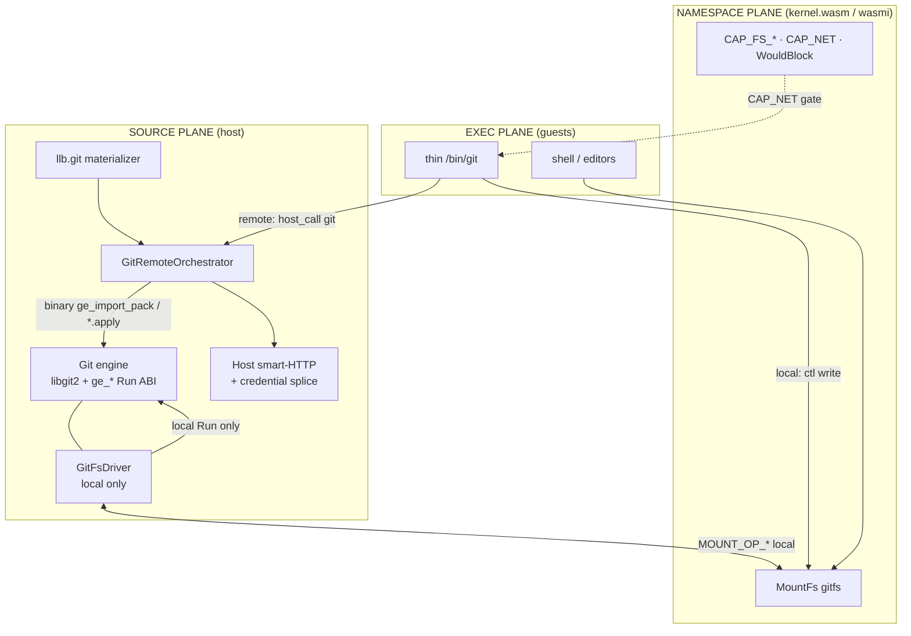
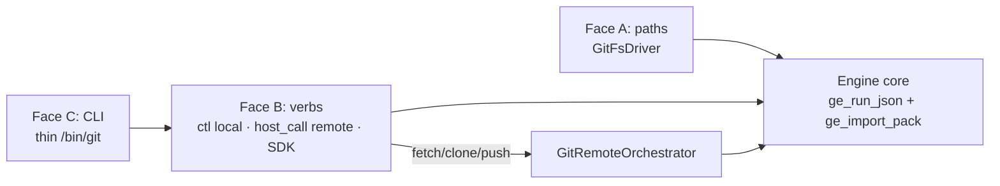
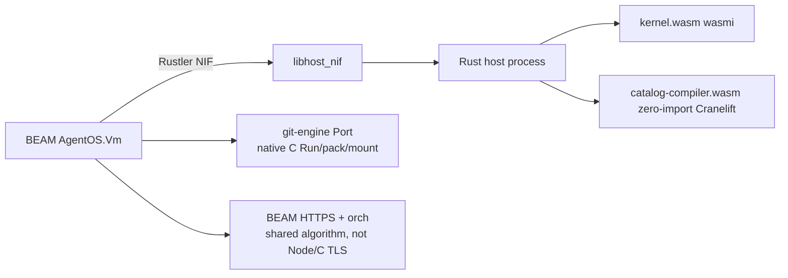
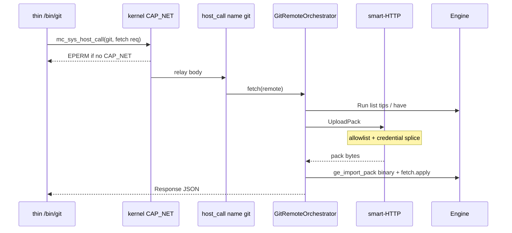
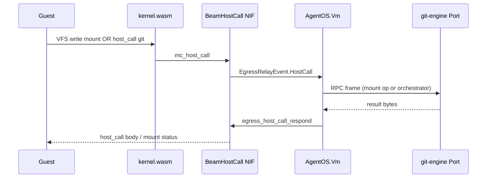
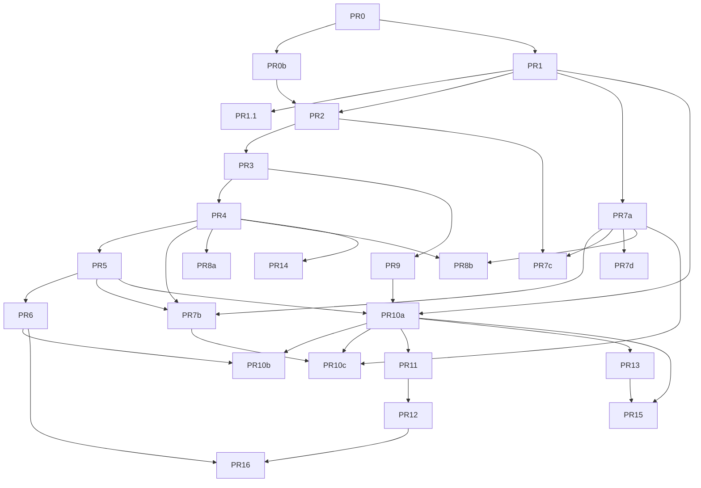

# AgentOS Git — Host Source Plane (libgit2)

| Field | Value |
|-------|--------|
| **Title** | AgentOS Git — Host Source Plane (libgit2) |
| **Author** | Design loop (AgentOS) |
| **Date** | 2026-07-30 |
| **Status** | Draft |
| **Replaces** | Workspace-root `GIT.md` + `GIT_DESIGN.md` (go-git / gojs era) — **single** design of record after approval |
| **Baseline systems** | `SYSTEMS.md` (Plan-9 VFS, MountFs, host-call, LLB, A1/A8/A9) |
| **Spike substrate** | `/mnt/workspace/git-bazel` — libgit2 1.9.2 + `ge_*` Run ABI, hermetic zig cc + emsdk |
| **Prior work** | go-git phase-0 spikes and PR0–PR2 go-git packaging are **superseded / abandoned** as product paths |

This document is intentionally complete enough to live as the monorepo-facing `GIT.md` (product architecture + implementation design). It retains the **soul and normative contracts** of the prior two docs while **pivoting the engine substrate from go-git/Go/gojs to libgit2 + Emscripten** (JS) and **native hermetic C** (server) proven in `git-bazel`. **No freestanding zig/wasmtime product path.**

---

## Overview

AgentOS needs git for agents and humans: natural worktree paths under the Plan-9 VFS, a reduced CLI with shell muscle memory, durable history across reload, and remotes that respect the same capability/credential model as tools and netfs. Placing a multi‑MiB VCS library (go-git or libgit2) as a **wasmi guest** fails the cost model (interpretation), concurrency policy (no second scheduler / asyncify under wasmi), and linear-memory ceiling (~2 GiB per engine instance for large monorepos).

**Solution:** git is a **host source plane**. A **libgit2 1.9.x** engine behind a thin C **`ge_*` Run facade** owns the object DB and local porcelain. A **`GitFsDriver`** projects the worktree through the existing `MountFs` + `mc_host_call` codec (local porcelain + paths only). A thin pure-mc **`/bin/git`** translates argv → local ctl verbs or CAP_NET-gated `host_call` name `git` for remotes. **Remotes are host-mediated** by a shared **`GitRemoteOrchestrator`** algorithm: host smart-HTTP + credential splice; engine only binary pack/ref apply. Runtimes: **JS** loads Emscripten `git_engine.js` + `git_engine.wasm` via `createGitEngineModule` (MODULARIZE, EXPORT_ES6 — **no gojs / no `wasm_exec.js`**); **server** uses **native hermetic C only** (`git-engine` binary / later c-shared via zig cc) — **not** freestanding wasm under wasmtime. BEAM owns lifecycle of any server child; **no Go NIF, no product Go for git**.



**One-line thesis:** paths and shell stay Plan-9-native inside the VM; git mechanics stay on the host next to LLB sources, catalog-compiler, and network/TLS — one engine ABI, host-appropriate runners, **libgit2 substrate**.

---

## Background & Motivation

### Current state

| Area | Today | Gap |
|------|--------|-----|
| Interactive VCS | None as a first-class AgentOS surface | Agents use ad-hoc host mounts or no history |
| LLB git | `llb.git` / `OP_GIT = 15` in `memcontainers/sdk-js/core/src/llb.ts` + `solve.ts` | Node solver shells out to system `git` (`solve-node.ts` → `spawn("git", …)`); not hermetic; unavailable in browser |
| Mount drivers | `hostDir`, `s3`, `vectorStore` via `Driver` + `dispatchMount` | No git-backed worktree projection |
| Host pure compute | `catalog-compiler.wasm` (zero-import) on JS + wasmtime | Precedent for **host-side** heavy work — git uses emcc (imports) or native C, same *placement* |
| Credentials | Connections catalog + host splice (`docs/connections.md`) | Git remotes must reuse this cut, not guest tokens |
| Spike | `git-bazel`: libgit2 1.9.2, `ge_*` ABI, emcc **~613 KiB** wasm (measured), outer-host smokes per **CAPABILITY.md** | Not yet in monorepo; jmin/fixed buffers incomplete porcelain to productize; SPIKE freestanding path is **not** a product option |
| Monorepo Go | No product git on go-git | **Do not** introduce `rules_go` for git — product path is C |

### Pain points

1. **Agents need paths, not git wire protocols.** Coding sessions want `/repo/src/…` and `git status`/`commit`.
2. **Wasm guest memory is the wrong place for object stores.** Large clones fight ~2 GiB and would inflate snapshots if the DB lived in guest heap.
3. **wasmi interprets guests.** Multi‑MiB engines per porcelain verb are the wrong cost center.
4. **LLB and sessions must not fork stacks.** System `git` for solve + separate session stack would drift.
5. **Secrets must never enter the guest.** Same invariant as tools: origin allowlist + credential splice at the host edge.
6. **CAP_NET must gate egress.** Mount writes alone are not network authority (A9).
7. **go-git as product substrate is abandoned.** Soft size ~11–25 MiB js wasm, gojs import surface, rules_go monorepo cost, and dual Go/TS packaging complexity lose to measured libgit2+emcc packaging.

### Why the substrate pivot (go-git → libgit2)

| Dimension | go-git (old design) | libgit2 + emcc (this design) |
|-----------|---------------------|------------------------------|
| JS artifact | **Historical spike / prior design:** `GOOS=js` ~11–12 MiB after strip/wasm-opt; soft budget ≤25 MiB (not re-measured in monorepo; worktrees deleted) | **Measured git-bazel:** `git_engine.wasm` **627 769 B ≈ 613 KiB** after `-Os` + Binaryen; soft budget **≤2 MiB** |
| Host imports | **gojs** (~22 names) + AgentOS gojs runtime in `@mc/host` | **Emscripten runtime only** — no gojs, no `wasm_exec.js` |
| Server runner | Native Go subprocess | **Native hermetic C** (`libgit_engine.so` / static) via zig cc |
| Build graph | rules_go / gazelle prerequisite | **rules_cc + emsdk + hermetic_cc_toolchain** |
| Dial purity | Must strip go-git transport | Easy refuse in `ge_run_json`; HTTPS/SSH backends **off** by default |
| License | go-git Apache-2.0 | libgit2 GPL-2.0 **with linking exception** — document notices + corresponding source |
| Spike evidence | Abandoned monorepo PR path | `git-bazel` engine + `agent-os/` outer-host smokes PASS (prefer `agent-os/CAPABILITY.md` over stale SPIKE.md non-goals) |

The **product architecture** (host source plane, Run ABI, host-mediated remotes, gitfs, thin CLI) is unchanged. Only the **engine implementation language and packaging** pivot.

### Product constraints (retained)

- Guest VFS holds **projected** repos; paths natural for shell/agents.
- Kernel never learns WASI or a git ABI; wasmi guests stay small.
- Progressive surface: **local porcelain → durability → remotes → LLB convergence**.
- Snapshots (MCSN) remain kernel state; host attachments rebind.

---

## Goals & Non-Goals

### Goals

1. Ship a **reduced, honest git surface** for interactive sessions (phase A porcelain first).
2. One portable **function-face ABI** (`Run` / `ge_run_json`) shared by SDK, ctl, thin CLI, and apply ops — **normative schema**.
3. **gitfs** via existing `MountFs` / `Driver` / `registerRaw` — no kernel git knowledge.
4. **Host-mediated remotes** only; engine never dials TLS or holds credentials.
5. **Guest-initiated remotes require CAP_NET** (kernel-enforced path); mount write alone is insufficient.
6. **JS + server** runners with identical guest/CLI/SDK contracts; BEAM unchanged except host capabilities.
7. Converge **`llb.git`** onto the same remote/apply substrate (end state).
8. Deterministic tests via injectable author/time (`when_unix` on commit).
9. Size discipline with **numeric soft budgets** (engine wasm **≤2 MiB**; thin guest CLI **≤256 KiB**).
10. **Hermetic C packaging** in monorepo — import `git-bazel` patterns (not go-git).

### Non-Goals

- Full git-core / libgit2 parity (every porcelain command).
- Teaching the kernel WASI, git, or Component Model for this feature.
- Production multi‑MiB **wasmi guest** VCS engines (go-git or libgit2).
- Stock `wasm_exec.js` / gojs as product artifacts.
- Zero-import pure `f(bytes)→bytes` for all of git (workspace state is not a pure function).
- Replacing developer or Bazel monorepo git on the AgentOS development machine.
- Multi-writer concurrent libgit2 on one mount.
- **Go-as-Erlang-NIF** / any product Go git engine.
- **go-git as product engine substrate** (spike/history only).
- Ambient host `~/.git-credentials` injection into the engine.
- **Objects façade** under `.git/objects` in v1 (synthetic HEAD/refs/ctl only).
- Freestanding zig wasm32 as **JS MVP** (document as secondary; emcc is JS primary).

---

## Proposed Design

### 1. Planes and faces

| Plane | Responsibility |
|-------|----------------|
| **Source (host)** | Engine (libgit2 + `ge_*`), durable packs, `GitRemoteOrchestrator`, smart-HTTP, LLB source ops, SDK `GitEngine` |
| **Namespace (kernel)** | `MountFs` slot, `CAP_FS_*` / `CAP_NET`, cooperative `WouldBlock`, snapshot gating on inflight host_call |
| **Exec (guest)** | Shell, editors, thin `/bin/git` |

Three faces over **one** engine core for **local** object/worktree ops; remotes add orchestration **outside** the engine:



**Rule:** commands are a shell adapter, not the internal ABI.

```text
┌─ JS host (browser · Node) ─────────────┐  ┌─ Server host (Elixir → NIF → Rust) ─────┐
│  git_engine.js + git_engine.wasm       │  │  native hermetic C preferred (same ABI) │
│  createGitEngineModule (emcc)          │  │  libgit_engine.so / static · optional   │
│  GitFsDriver · host-mediated remotes   │  │  native C git-engine · c-shared later   │
└──────────────────▲─────────────────────┘  └──────────────────▲──────────────────────┘
                   │  ge_run_json + mount codec · same contract │
                   └────────────────────┬──────────────────────┘
                                        │ mc_host_call
┌───────────────────────────────────────▼─────────────────────────────────────────────┐
│  kernel.wasm (wasmi)                                                                │
│   MountFs gitfs · thin /bin/git · shell/editors on the same mount                   │
└─────────────────────────────────────────────────────────────────────────────────────┘
```

### 2. Component map (production placement in monorepo)

Import and productize patterns from `git-bazel` into the AgentOS monorepo. Propose:

| Component | Monorepo location | Role |
|-----------|-------------------|------|
| Engine (C) | `memcontainers/lib/git-engine/` | libgit2 + `ge_*` Run ABI; builds `git_engine_wasm` + `libgit_engine` / static |
| libgit2 + patches + license | `third_party/libgit2/` (BCR dep + patches + **NOTICE/COPYING** + corresponding-source packaging) | Pin **1.9.2**; HTTPS/SSH off by default; emscripten integer patch; **§License packaging checklist** |
| Bazel helpers | **Reuse monorepo:** `//bazel/wasm_opt.bzl`, **`//bazel/tools/size:size_limit`** (`defs.bzl` macro). **Import only if missing:** `bazel/force_opt.bzl` from git-bazel. Do **not** invent a second `size_limit` rule. | force_opt → emcc -Os → wasm-opt -Oz → monorepo `size_limit` |
| `GitEngine` + orchestrator + `GitFsDriver` | `memcontainers/sdk-js/core/src/git/` | TS: loader, orchestrator, mount driver (promote `git-bazel/agent-os/src/*`) |
| Thin `/bin/git` | `memcontainers/programs/git/` | Pure-mc Zig preferred |
| Server engine Port | Native C **`git-engine` binary** (thin main over `git_engine_lib`); BEAM-owned Port (ad-hoc like Firecracker helper `Port.open`, **not** full sidecar lifecycle MVP) | Length-prefixed RPC frames type 1–4; mount/ctl via type 4 after PR7b |
| Server remotes (MVP) | **BEAM HTTPS + Elixir orch** (same algorithm as TS; golden traces); engine apply only (K16) | No Node on server; no C TLS — BEAM uses the same host egress family as kernel HTTP |
| Elixir Port owner | `server/lib/agent_os/git_engine.ex` (new) + hooks in `vm.ex` / `control_plane.ex` | Start/stop Port with VM; `egress_host_call_respond` |
| ABI fixtures | `memcontainers/lib/git-engine/testdata/abi/` | Golden JSON for dual-runner conformance |
| License notices | `third_party/libgit2/NOTICE`, upstream COPYING*, `//third_party/libgit2:corresponding_source` | Linking exception compliance from **PR0** |

**Spike remains phase-0 proof.** Promote code carefully: replace fixed-buffer `jmin` limits and incomplete porcelain with product-grade buffers/ops; do not copy spike gaps blindly.

### 3. Engine ABI (normative)

**C header** (product form of `git-bazel/engine/include/git_engine.h`):

```c
/* ge_engine ≈ one gitfs mount. Paths in args are worktree-relative; no dial.
 *
 * ge_open(worktree_root):
 *   - worktree_root MUST be an absolute path (native) or absolute MEMFS path (emcc).
 *   - The directory MUST already exist; ge_open does not mkdir.
 *   - Does not create a repository until op "init" (open existing repo if present).
 *   - One ge_engine instance ≈ one gitfs mount / one worktree root.
 */
typedef struct ge_engine ge_engine;

ge_engine *ge_open(const char *worktree_root);
void       ge_close(ge_engine *e);
char      *ge_run_json(ge_engine *e, const char *request_json); /* free with ge_free */
int        ge_import_pack(ge_engine *e, const uint8_t *chunk, size_t len, int final);
const char *ge_last_error(const ge_engine *e);
void       ge_free(void *p);
const char *ge_version(void);
```

**`GitEngine.load`:** host glue creates/ensures the worktree directory (emcc: `Module.FS.mkdirTree("/work")` or durable mount path; native: real absolute directory), then calls `ge_open` with that absolute path. Callers never pass relative roots.

#### 3.1 Request / Response (JSON)

```json
// Request — {op, args} only (no top-level cwd/author)
{ "op": "commit", "args": { "message": "initial", "all": false,
  "name": "Agent", "email": "agent@example.com", "when_unix": 1700000000 } }

// Response
{ "ok": true, "code": 0, "stdout": "[abc1234] initial\n…", "stderr": "",
  "result": { "hash": "abc1234…" } }
```

| Field | Meaning |
|-------|---------|
| `code` | `0` ok, `1` operational error, `2` usage / unknown op / bad JSON |
| Author/time | In op-specific args or engine defaults — **not** top-level request fields |

Optional `abi_version` reserved for future breaks; v1 omits it (implied 1).

#### 3.2 Reserved / forbidden ops (product builds)

| Class | Ops |
|-------|-----|
| **Local (phase A full surface)** | `init`, `status`, `diff`, `add`, `rm`, `commit`, `log`, `show`, `branch`, `checkout`, `switch`, `reset`, `rev-parse`, `tag`, `config`, `remote` (config only: list/add/remove URL), `write` (host/engine test helper — optional for SDK, not thin CLI) |
| **Apply (phase C, network-free)** | `refs.import`, `pack.import` (metadata only in JSON), `clone.apply` (metadata), `fetch.apply` (metadata), `push.prepare`, `push.complete` |
| **Forbidden in product** | Any op that dials: `clone` / `fetch` / `pull` / `push` that open sockets — **always** `code:1`, stderr mentions host-mediated remotes |

Unknown `op` → `code: 2`, fail closed.

##### PR1 minimum vs deferred (productize gate)

| Gate | Ops / requirements |
|------|---------------------|
| **PR1 required (exit)** | `init`, `write`, `add`, `commit`, `status`, `log`, `rev-parse`, `branch` (list/create), `checkout`/`switch`; dial refuse for `clone`/`fetch`/`pull`/`push`; **product-grade JSON/args buffers** (no spike jmin fixed caps — hard gate); golden fixtures for init→commit→log; `ge_import_pack` may be stub returning success/error only |
| **PR1.1 / before remotes GA** | `rm`, `diff` (status-style ok; full patch later), `show`, `reset` (soft/mixed/hard), `tag`, limited `config`, `remote` config list/add/remove; complete `ge_import_pack` + `refs.import` / `clone.apply` / `fetch.apply` |
| **PR5-adjacent** | Synthetic HEAD/refs coherence with above ops (driver side) |
| **Do not ship** | Spike `write` 64 KiB content caps or fixed small stdout buffers as product defaults |

#### 3.3 Binary pack path (normative from first remote PR)

JSON `Run` **must not** carry multi‑MB pack payloads as base64/string fields.

| API | Transport | Payload |
|-----|-----------|---------|
| `ge_run_json` / `Engine.Run` | JSON | Metadata, refs lists, small results |
| `ge_import_pack(chunk, len, final)` | **Binary** (native / RPC frame type `pack`) | Raw pack bytes via `git_indexer_*` |
| Finalize | last chunk with `final!=0` or `Run(pack.import)` meta | Then `clone.apply` / `fetch.apply` without embedded packs |

**Limits (soft gates, product defaults):**

| Limit | Default |
|-------|---------|
| Max single pack import (interactive) | **64 MiB** total before reject |
| Max single JSON `Run` args size | **1 MiB** |
| Max `stdout` returned in one Response | **1 MiB** (overflow → truncated + `result.truncated=true` or full body on ctl out) |

#### 3.4 Invariants

1. **Single ABI** — local faces map into `Run` / `ge_run_json`; packs use `ge_import_pack`.
2. **One engine instance per gitfs mount** — FIFO single-writer queue on the host driver.
3. **Path safety** — worktree-relative; reject absolute and `..` (`ge_safe_relpath` pattern).
4. **JSON args fail closed** — decode errors → code 2.
5. **Injectable clock + author** for deterministic tests (`when_unix`, name, email).
6. **No product network dial** in engine; libgit2 HTTPS/SSH backends **compile-time off**.
7. **VFS hooks** for mount driver — worktree files via engine FS (emcc `Module.FS` on JS; native paths on server).

### 4. Engine runtimes (normative packaging)

#### 4.1 Catalog-compiler placement (precedent, honest)

`memcontainers/lib/catalog-compiler/` is **zero-import** pure wasm — JS and wasmtime/Cranelift load the **same** module. That pattern is **placement** (host-instantiated, not wasmi guest), not “any wasm runs under Cranelift without imports.”

#### 4.2 What we ship

| Host family | Preferred engine runner | Artifact |
|-------------|-------------------------|----------|
| **Browser / Node** | **Emscripten** `createGitEngineModule` | `git_engine.js` + `git_engine.wasm` |
| **Server / remote** | **Native hermetic C only** (zig cc) | `git-engine` binary and/or `libgit_engine.so`; length-prefixed RPC |

**Rejected product runner:** freestanding zig `wasm32` under wasmtime (or any freestanding wasm engine artifact).



| Option | Status |
|--------|--------|
| **A1 — Native C subprocess Port** | **Server engine MVP (chosen)** — isolation, crash containment |
| **A2 — Native C c-shared in-process** (`dlopen` / link into host) | **Planned immediately after A1 MVP** (PR7d); latency path (K15) |
| **B — Freestanding ge_* under wasmtime** | **Rejected** — not a product path |
| **B′ — wasmi guest libgit2/go-git** | **Rejected** |
| **C — Go NIF / go-git product** | **Rejected** |
| **D — Cranelift of emcc module as JS substitute** | Not needed; native C preferred on server |

**Invariant:** guest, gitfs codec, thin `/bin/git`, and host-mediated remotes **do not care** which runner is active. Only the host’s `GitEngine` handle changes.

#### 4.3 Emscripten path (normative JS packaging)

From `git-bazel/engine/BUILD.bazel` — encode as monorepo targets:

```text
force_opt (import bazel/force_opt.bzl if needed)
  → emcc -Os → MODULARIZE=1 EXPORT_ES6=1 EXPORT_NAME=createGitEngineModule
  ENVIRONMENT=web,worker,node ALLOW_MEMORY_GROWTH FILESYSTEM=1
  EXPORTED_FUNCTIONS=@ge_* only (not full git_*)
  → //bazel/wasm_opt.bzl (-Oz)
  → //bazel/tools/size:size_limit ≤2 MiB
```

Exported symbols (allowlist): `_malloc`, `_free`, `_ge_open`, `_ge_close`, `_ge_run_json`, `_ge_import_pack`, `_ge_last_error`, `_ge_free`, `_ge_version`.

Runtime methods for host glue: `ccall`, `cwrap`, `UTF8ToString`, `stringToUTF8`, `HEAPU8`, `FS`, `PATH`, etc.

```js
import createGitEngineModule from "./git_engine.js";
const Module = await createGitEngineModule({ locateFile: … });
// Module._ge_open / _ge_run_json / Module.FS
```

**No gojs. No stock `wasm_exec.js`.**

#### 4.4 Native hermetic path

- **Toolchain:** `hermetic_cc_toolchain` (zig cc) — no host gcc required. **Scoped to git-engine package transitions only** — do **not** re-register hermetic_cc as the default C++ toolchain for the whole monorepo guest/host graph (existing Zig wasm32 + rules_cc lanes stay authoritative for non-git packages). See PR0 risks.
- **Backends:** HTTPS/SSH **off** by default (engine purity; remotes are host-mediated). Product engine targets **assert** backends off (copts / `select()` / build flags — see License checklist).
- **Artifacts:** `//memcontainers/lib/git-engine:git_engine_lib`, `:libgit_engine` (`.so`), thin `git-engine` binary for BEAM Port.

#### 4.5 Measured sizes (product-relevant)

| Measurement | Value |
|-------------|--------|
| Emcc `git_engine.wasm` (git-bazel, after wasm-opt) | **627 769 B ≈ 613 KiB** |
| Soft gate emcc product CI | **≤ 2 MiB** |

git-bazel’s freestanding zig build is **spike-only**; it is **not** packaged, sized, or supported as a product runner.

### 5. gitfs / MountFs integration

#### 5.1 Existing substrate

- Kernel: `memcontainers/kernel/rust/src/fs/mountfs.rs` — whole-file open, commit buffer on **Drop**, last-writer-wins, **not POSIX**; `WouldBlock`; pending Drop commits best-effort.
- Constants: `MOUNT_OP_OPEN`…`MOUNT_OP_WRITE` in `contracts/gen/constants.gen.*`.
- SDK: `embedded.ts` `registerRaw(path, body => dispatchMount(driver, body))`; `mount.ts` `dispatchMount`; `Driver` in `types.ts`.
- Docs: `docs/mounts-drivers.md`.

#### 5.2 Projection layout (v1)

```text
/workspace/{name}/                    worktree (default convention; path is configurable — K27)
/workspace/{name}/.git/HEAD           synthetic text
/workspace/{name}/.git/refs/…         synthetic ref tips (optional read)
/workspace/{name}/.git/mc/ctl         ctl request/response
/workspace/{name}/.git/mc/out/last    alias: last response body (always full Response JSON)
/workspace/{name}/.git/mc/generation  decimal generation counter (read-only text)
```

Examples and smokes may still use a short path when `name` is fixed (e.g. `/workspace/repo`); **product default** is configurable with **`/workspace/{name}`**.

**v1:** no `.git/objects` façade. Tools that require a real on-disk git dir are out of surface.

#### 5.3 Ctl protocol (normative — implementable on MountFs)

MountFs only supports whole-file `open`/`write` (driver `write(path, data)` after guest Drop). Ctl must work with that.

| Path | Kind | Behavior |
|------|------|----------|
| `/.git/mc/ctl` | file | **Write:** full request JSON; driver runs verb **synchronously inside `write()`** before returning host_call success. **Open/read:** returns last **Response** JSON. |
| `/.git/mc/out/last` | file | Read-only copy of last Response JSON. |
| `/.git/mc/generation` | file | Monotonic `u64` decimal; increments on each completed ctl `write`. |

**Only local ops** on ctl. Remote ops on ctl → Response `{ ok:false, code:1, stderr:"use host_call git for remotes" }`. Prefer Response over errno so thin CLI can print stderr. (Write host_call status 0; Response.ok false.)

**Why Run inside `write()` not Drop:** MountFs parks guest writes and commits on Drop with **best-effort** host ack (`mountfs.rs`: `pending_commits` drained on the **next** mount op and on `mc_tick` via `drain_all`). Ctl must return a structured result; therefore the driver handles ctl on the **MOUNT_OP_WRITE** that carries the full buffer (when the parked Drop commit is drained).

```text
# thin CLI / guest — local porcelain
1. open(O_WRONLY|O_TRUNC)  /.git/mc/ctl
2. write(requestJSON) ; close()     # Drop parks MOUNT_OP_WRITE; not yet guaranteed drained
3. open(O_RDONLY) /.git/mc/ctl  (or /.git/mc/out/last)
   # open issues a new mount op → drain_commits runs → driver.write executes Run
4. read(responseJSON) ; parse code/stdout/stderr ; exit(code)
```

**Drain / read-after-write invariant (normative e2e):**

1. After ctl write+close, the **next** open/read of `/.git/mc/ctl` or `/.git/mc/out/last` **must** observe the Response for that write (generation advanced by exactly one for that writer’s completion).
2. Thin CLI **must not** assume synchronous host ack on close alone; it **must** issue a following open/read that triggers MountFs drain (or wait until an intervening `mc_tick` drain — product thin CLI always does open/read, never close-only).
3. Failure mode if drain lags or a second writer interleaves: generation mismatch → retry open/read once; if still wrong, fail closed with stderr `git: ctl race` / code 1.
4. Acceptance (PR5/PR6): write Request with known `client_token` → close → open/read → Response contains token and expected code; generation check as in single-writer section.

**Single-writer queue:** all `ge_run_json`, worktree mutating FS ops, and ctl writes share one FIFO per mount. Optional `args.client_token` echoed in `result.client_token`; `generation` detects response races.

**Large stdout:** if Response would exceed 1 MiB, set `stdout` to a preview, `result.truncated=true`, and keep full body on `/.git/mc/out/last` (raise limit for out/last to 8 MiB or stream via host_call later).

| Case | Behavior |
|------|----------|
| Invalid JSON / unknown op | Store Response code 2; write host_call ok |
| Engine error | Response code 1; stderr message |
| Read-only mount | Mutating ops → Response code 1 or driver EACCES |
| Remote op on ctl | Response code 1; **no network** |
| Engine runner dead (server) | driver.write throws → guest EIO |

#### 5.4 Worktree coherence (MountFs last-writer-wins)

1. Engine worktree / index reflects only **completed** driver `write` / `unlink` / `rename` / `mkdir` ops.
2. Guest FDs with unflushed buffers are **invisible** to `git status` until close/Drop — **same class as `hostDir`**. Document for agents/editors.
3. `git status` after close agrees with engine content — **exit criterion for gitfs PR**.
4. Single-writer queue: `git add` and worktree `write` serialize on the engine.
5. **Monorepo / large files:** full-file RMW cost is inherent to MountFs; mitigate with sparse cones (phase B).

#### 5.5 Attach

```ts
// memcontainers/sdk-js/core/src/git/
const engine = await GitEngine.load(…);
await vm.mount("/workspace/my-app", engine.asMountDriver(), { readOnly: false });
// registerRaw("/workspace/my-app", …) + host.mount — same as hostDir/s3
// Default convention: /workspace/{name} (K27); configurable per session.
```

| Concern | Behavior |
|---------|----------|
| Everyday I/O | Map to engine worktree (emcc FS / native path) |
| Local porcelain | Ctl protocol |
| Read-only | Reject mutating ctl + write methods |
| Single-writer | FIFO |
| Bytes only | A1 — never host handles to guest |
| Snapshot | In-flight host_call → inflight_egress blocks snapshot |

### 6. Thin `/bin/git` (guest)

| Item | Choice |
|------|--------|
| Implementation | Freestanding Zig pure-mc preferred (alongside `programs/coreutils`, `programs/sh`) |
| Local ops | Ctl protocol only (`CAP_FS_WRITE`) |
| Remote ops (phase C) | `mc_sys_host_call` with name **`git`** + Request JSON body — kernel gates with **CAP_NET** |
| Size budget | **≤ 256 KiB** post-opt (soft CI gate) |

**Mount selector (normative v1):**

| Rule | Detail |
|------|--------|
| **At most one gitfs mount per VM** | v1 product constraint. Second `vm.mount` of a gitfs driver fails closed on the host. |
| Guest remote host_call | Request is still `{ "op", "args" }`. **`args.mount` optional in v1** and ignored if present unless it equals the sole mount path; mismatch → code 1. |
| Thin CLI discovery | Walk parents for `/.git/mc/ctl` |
| Multi-repo (post-v1) | Require `args.mount` on every guest remote host_call |

**Local flow:**

```text
git commit -m M
  → find gitfs root (walk for /.git/mc/ctl)
  → write Request { "op":"commit", "args":{ "message":"M" } } to ctl
  → read Response → print stdout/stderr → exit(code)
```

**Remote flow:**

```text
git fetch origin
  → require CAP_NET
  → mc_sys_host_call("git\0" + Request{ "op":"fetch", "args":{ "remote":"origin" } })
  → host routes to GitRemoteOrchestrator
  → read result fd → exit(code)
```

Unknown commands fail closed. Meta: `version`, `help`.

### 7. Host-mediated remotes + orchestration

#### 7.1 Model

Remotes are a **host service** that turns `(URL or connection ref, policy, credentials)` into **pack bytes + ref tips**. The git engine is a **pure object database** that applies those bytes. The guest sees only paths + thin CLI verbs — never TLS, never tokens.

```text
┌──────────────── HOST ─────────────────┐     ┌──────── ENGINE (libgit2) ─────────┐
│  Policy · CAP_NET · origin allowlist  │     │  objects · refs · index · tree    │
│  TLS / smart-HTTP · auth splice       │     │  NO sockets · NO secrets          │
│  ListRefs · UploadPack · ReceivePack  │     │  pack.import · refs.import · …    │
└───────────────────┬───────────────────┘     └────────────────▲─────────────────┘
                    │  bytes only (packs, ref lists, status)   │
                    └──────────────────────────────────────────┘
```

#### 7.2 `GitRemoteOrchestrator` (logical module)

**Logical contract** is one: ordered steps, defaults, and error codes below. **Implementations (normative MVP):**

| Host | Orchestrator + smart-HTTP | Engine apply |
|------|---------------------------|--------------|
| **JS (browser/Node)** | TypeScript in `memcontainers/sdk-js/core/src/git/{remote-orchestrator,smart-http}.ts` | In-process emcc `ge_run_json` / `ge_import_pack` |
| **Server (Elixir control plane)** | **BEAM HTTPS + Elixir orchestrator** (OTP `:httpc`/ssl — same host egress family as kernel HTTP answers; **no Node, no C TLS**) | Native C `git-engine` Port: apply only (`import_pack`, `refs.import`, `*.apply`, local Run, type-4 mount) |

**K16 (revised 2026-07-31):** **TS only on the JS host family** (browser/Node). **Server remotes: BEAM owns smart-HTTP + orchestrator** using the control plane's existing HTTPS capability — **no Node/Bun on server**, **no C HTTPS client**. C `git-engine` stays dial-free (apply + local only). Dual-host drift is mitigated by a **shared algorithm spec + golden traces** (TS orch ↔ Elixir orch), not by putting TLS in the Port child.

**Server remote process topology (MVP):**

```text
AgentOS.Vm (BEAM)
  ├─ HTTPS smart-HTTP + orch (ListRefs / FetchPacks / PushPacks)
  │     credential splice + origin policy (connections)
  └─ Port → git-engine (native C, no network)
         ├─ Run / ImportPack / binary MOUNT_OP type-4
         └─ apply only (pack.import / refs.import / clone.apply / …)
```

(No Node on server. No C TLS. Browser/JS host still uses in-process TS orchestrator + emcc engine.)

Used by:

| Entry | Path |
|-------|------|
| SDK `GitEngine.clone/fetch/push` (JS) | Direct call into TS orchestrator |
| Guest remote via host_call `git` (JS embedded) | **`MapHostCall.register("git", …)`** (raw host_call name) → TS orchestrator — **not** catalog-only |
| Guest remote via host_call `git` (Elixir) | `BeamHostCall` → BEAM → **BEAM HTTPS orch** → Port apply frames |
| Optional agent tool | Catalog tool **`git run`** (Face B) for local Run — distinct from CAP_NET name `"git"` |
| Ctl / GitFsDriver | **Does not** run remotes (fail closed) |
| LLB | Same algorithm (end state); host language per solve platform |



#### 7.3 Orchestrator algorithm (normative)

Both TS and server implementations **must** follow these steps and map failures to the same `Response.code` / stable `stderr` prefixes. Ship optional golden **trace** fixtures (ordered step names).

**Defaults:** shallow `depth=1` unless args override; `single_branch=true` for clone; public HTTPS only until connections PR; max pack **64 MiB** interactive; engine never dials.

**Shallow clone** (`op: "clone"` at orchestrator; engine sees only apply ops):

1. `policy.check_origin(url)` — deny → code 1, `git: origin denied`
2. `http.ListRefs(url)` — fail → code 1, `git: list-refs failed: …`
3. Select want tip; have=[]
4. `http.FetchPacks(url, want, have, depth)` — oversize → `git: pack too large`
5. `engine.ImportPack` / `ge_import_pack` (binary chunks) until complete
6. `engine.Run(refs.import)` / remote-tracking as needed
7. `engine.Run(clone.apply)` metadata only (HEAD + checkout branch)
8. Return Response ok with `result.head`

**Fetch:** resolve remote → check origin → list local have → ListRefs + FetchPacks → ImportPack + `fetch.apply`.

**Pull v1:** fetch then local fast-forward only (no rebase); FF fail → `git: not fast-forward`.

**Push:** check origin + optional approval → ListRefs for lease → `push.prepare` → host pack stream + `PushPacks` → `push.complete`.

**Error codes:** `0` ok, `1` operational, `2` usage. No tokens in stderr.

#### 7.4 CAP_NET enforcement

| Initiator | Network allowed when |
|-----------|----------------------|
| Guest thin CLI / guest code | Kernel **`CAP_NET`** on `mc_sys_host_call` only. Mount/ctl **must not** start smart-HTTP. |
| Embedder SDK on host | Host policy (`net: true` / connections); no guest cap |
| LLB solve | Solve platform policy (host) |

**Why not ctl + mount write:** MountFs host_calls are gated by `CAP_FS_WRITE`, **not** `CAP_NET`. Treating ctl as network authority would violate A9.

**Acceptance:** e2e guest without CAP_NET receives EPERM on `git fetch`; with CAP_NET + public HTTPS, shallow fetch works; ctl `{"op":"fetch"}` never dials.

#### 7.5 Host remote port

```text
ListRefs(ctx, remoteURL) → RefAdvertisement
FetchPacks(ctx, remoteURL, want[], have[], depth) → PackBundle (binary)
PushPacks(ctx, remoteURL, commands[], packStream) → ReceiveStatus
```

Do not depend long-term on system `git`. `solve-node.ts` system-git is transitional until LLB convergence.

#### 7.6 Credentials

| Rule | Detail |
|------|--------|
| Secrets never in guest | CLI sends remote **name** or public URL |
| Connection refs | `remote.origin.agentos = github.user.work` |
| Origin allowlist | Exact match before splice |
| Destructive push | Optional `require_approval` |
| Read-only gitfs | Reject push |
| No ambient developer git | Never read `~/.git-credentials` into engine |

Config shape:

```text
remote.origin.url = https://github.com/org/repo.git    # public locator
remote.origin.agentos = github.user.work               # optional connection id
```

### 8. Server / Elixir integration

**Single normative wire:** for control-plane VMs, **BEAM owns host_call answers and the engine child**. Rust NIF / `BeamHostCall` only **relays** — it does not open the C subprocess or answer mount/`git` itself.

#### 8.1 Ownership tree (MVP)

**Primary touch files:**

| File | Role |
|------|------|
| `server/lib/agent_os/git_engine.ex` | **New** Port owner module: start/stop `git-engine`, length-prefixed RPC encode/decode, crash → fail handles |
| `server/lib/agent_os/vm.ex` | Wire gitfs attach/detach to Port lifecycle; GenServer callbacks for host_call demux |
| `server/lib/agent_os/control_plane.ex` | Existing `egress_host_call_respond` / `egress_host_call_fail` — no new NIF |
| `server/lib/agent_os/sidecars/firecracker/helper.ex` | **Pattern reference only** (`Port.open({:spawn_executable, …})`) — git-engine is an **ad-hoc Port**, not a full sidecar provider MVP |
| `server/BUILD.bazel` / release layout | Package `git-engine` binary next to server release artifacts |
| `memcontainers/lib/git-engine/` | `cc_binary` git-engine main |

```text
AgentOS.Vm (BEAM process)                    ← one owner per VM
  ├─ NIF KernelHost (DirtyCpu): boot/tick/snapshot/mount table
  │     host_call capability = BeamHostCall  → events to BEAM
  ├─ Port → git-engine (native C)            ← AgentOS.GitEngine
  │     stdin/stdout: length-prefixed RPC
  │     Run / pack / binary MOUNT_OP only (no network in child)
  ├─ Git session state (Elixir): mount_path, durable opts, connection policy refs
  └─ On EgressRelayEvent::HostCall { name, body, handle }:
        if name is absolute path and path is this VM's gitfs mount
           → binary MOUNT_OP type 4 to git-engine (PR7b)
           → egress_host_call_respond(handle, result_bytes)
        else if name == "git"
           → BEAM smart-HTTP + orch (HTTPS) → Port import/apply
           → egress_host_call_respond(handle, Response JSON)
        else
           → existing tool/sidecar handling (unchanged)
```

| Item | Spec |
|------|------|
| Engine binary | `git-engine` — Run / ImportPack / mount codec only (dial-free) |
| Remote orch (MVP) | **BEAM HTTPS + Elixir orch** (K16); browser/Node uses TS |
| Protocol (engine Port) | Length-prefixed frames: `u32le length \| u8 type \| payload` — type 1 = JSON Run; type 2 = pack chunk; type 3 = pack meta; type 4 = **binary MOUNT_OP** (K30). Type 5 optional/test-only. |
| Protocol (remote) | BEAM routes host_call `"git"` → BEAM smart-HTTP → Port apply; **no Node orch** |
| Who starts/stops children | **BEAM `AgentOS.Vm`** via `AgentOS.GitEngine` when first gitfs mount attaches (or at boot if declared); **stop on VM stop/crash/terminate** |
| Who holds child stdio | **BEAM** (Port). Not the Rust NIF. |
| Who answers host_call | **BEAM** via existing `egress_host_call_respond` / `egress_host_call_fail` |
| Crash | Port exit → BEAM fails in-flight handles; subsequent git ops → guest **EIO** |
| Go NIF / go-git child | **Rejected** |



#### 8.2 Where engine / driver logic lives by deployment

| Deployment | Engine process | Who answers mount host_call | Who answers name `git` |
|------------|----------------|----------------------------|-------------------------|
| **JS embedded** | in-process emcc wasm | Same JS `MapHostCall` + `dispatchMount(GitFsDriver)` | **`MapHostCall.register("git")`** → TS orchestrator (raw host_call; CAP_NET) |
| **JS remote SDK** | **Client-side** engine | Client `drivers` map + unified WS `hostCall` | Client registers raw name `"git"` the same way |
| **Elixir control plane** | **Server** `git-engine` **owned by BEAM** (apply only) | BEAM → Port type 4 binary MOUNT_OP (PR7b) | BEAM HTTPS orch → Port apply (PR10c) |

Browser never runs the native C subprocess; browser uses emcc wasm.

#### 8.3 NIF surface

| Change | MVP? |
|--------|------|
| New git-specific NIF exports | **No** |
| Existing boot/tick/snapshot/mount/egress relay | **Yes** |
| `BeamHostCall` | **Yes** — remains sole server host_call capability for control-plane VMs |
| Composite Rust intercept for `/repo` and `git` | **No** (deferred) |

### 9. State, snapshots, durability

| State | Location | In MCSN? |
|-------|----------|----------|
| Mount table gitfs slot | kernel | yes |
| Object DB, packs | host engine / OPFS / disk | **no** — reattach |
| Dirty worktree | host until completed write | **no** |
| Thin `/bin/git` | image | yes |
| In-flight host_call | host handle | snapshot blocked |

**Product honesty:** snapshotting a coding agent does not silently include a full object database unless the embedder also persists and rebinds the engine’s durable backend. Same class as persistfs/netfs/tools (A8).

| Host | Store |
|------|--------|
| Browser | OPFS / IndexedDB packs + loose objects (later PR) |
| Node | Directory or pure memory for tests |
| Remote server | Disk via native engine store |

### 10. LLB alignment

Today: `OP_GIT = 15`; `solve-node.ts` uses system `git`. Target: same orchestrator algorithm + engine apply path. Interactive gitfs and `llb.git` share one host git substrate (same fetch/checkout/object access), not two stacks.

| LLB | Interactive AgentOS |
|-----|---------------------|
| Solver resolves Git | Host engine / durable store |
| Result is a tree | `gitfs` worktree projection |
| Exec does not embed full git | Guest uses paths + thin CLI |
| Cache identity on content | OPFS/disk + reattach; LLB cache remains host-side |

### 11. Reduced command surface

Honest reduced CLI — **not** git-core parity. Unknown commands fail closed.

#### Phase A — local porcelain

| Command | Engine op | Notes |
|---------|-----------|--------|
| `version` / `help` | meta | Identity / surface list |
| `init` | `init` | Empty repo at mount |
| `status` | `status` | Short or porcelain-v1 subset |
| `diff` | `diff` | Path-list / status-style first; full patch later |
| `add` / `rm` | `add` / `rm` | Paths relative to worktree |
| `commit` | `commit` | `-m` required in thin CLI |
| `log` / `show` | `log` / `show` | Bounded |
| `branch` | `branch` | List / create / delete local |
| `checkout` / `switch` | `checkout` | Branch or rev |
| `reset` | `reset` | soft / mixed / hard |
| `rev-parse` | `rev-parse` | Resolve to hash |
| `tag` | `tag` | Later in A |
| `config` | `config` | Limited keys only |
| `remote` | `remote` | Config only until phase C |

#### Phase B — monorepo materialization

Sparse-checkout and partial trees for large repos without loading full history into the engine heap. Still host-side; guest only sees the projected worktree.

#### Phase C — remotes (host-mediated)

| Command | Notes |
|---------|--------|
| `clone` / `fetch` / `pull` / `push` | Host smart-HTTP + engine apply only |
| `submodule` | Network parts host-mediated; later |

#### Explicitly out of surface

Interactive rebase, bisect, LFS, worktrees-as-git-feature, full credential helpers, `git gui`, server-side `git receive-pack` as a guest service, replace of developer/Bazel monorepo git.

### 12. Packaging, images, size budgets

| Artifact | Consumer | Soft CI budget | Measurement source |
|----------|----------|----------------|--------------------|
| Thin `/bin/git` | Guest image | **≤ 256 KiB** post wasm-opt | product gate via `//bazel/tools/size:size_limit` |
| `git_engine.wasm` | JS hosts | **≤ 2 MiB** | **Measured git-bazel:** 627 769 B ≈ 613 KiB |
| `libgit_engine.so` / `git-engine` | Server | track size; no hard gate v1 | — |
| Max interactive pack import | Orchestrator | **64 MiB** | product default |
| Max JSON Run args | Engine | **1 MiB** | product default |

`git_engine.{js,wasm}` is a **host** artifact (like catalog-compiler), not required inside every guest image tar.

**libgit2 pin:** **1.9.2** (BCR `1.9.2.bcr.1` + `emscripten_integer.patch` as in git-bazel).

**go-git size figures** (~11–12 MiB js wasm, soft ≤25 MiB) are **historical prior-design / deleted-spike** numbers only — not a live monorepo budget.

### 13. Productize spike gaps (do not copy blindly)

| Spike limitation | Product requirement |
|------------------|---------------------|
| Fixed-buffer `jmin` / small content caps (`write` 64 KiB etc.) | Growable JSON/args; document hard limits if any remain |
| Incomplete porcelain (partial reset/tag/config/remote, stub apply) | PR1 minimum ops table §3.2; PR1.1 for rest; full apply before remotes GA (PR10a) |
| MEMFS-only durability | OPFS/disk backends |
| Outer host on **release** pin (v0.4.0) | First-class monorepo packages + e2e against live kernel |
| Luau thin CLI only | Pure-mc Zig `/bin/git` in image |
| No BEAM Port | Server PR with C subprocess ownership |

### 14. Risks

| Risk | Severity | Mitigation |
|------|----------|------------|
| Engine wasm size creep | Medium | ≤2 MiB soft gate; export only `ge_*`; wasm-opt CI |
| 2 GiB engine heap (wasm) | High | Shallow default; sparse; native server; 64 MiB pack cap |
| Dual-runner ABI drift | High | Golden fixtures; conformance suite JS vs native |
| CAP_NET bypass via ctl | High | Ctl remotes forbidden; host_call only |
| MountFs coherence | Medium | Document unflushed FD gap; e2e close-then-status |
| Single-writer bottlenecks | Medium | FIFO docs; multi-mount later |
| Secret leakage | High | No tokens in ctl/host_call body; redacted logs |
| libgit2 license compliance | Medium | Notices + corresponding source of libgit2 + patches in releases |
| jmin/buffer product debt | Medium | Replace in PR1; do not ship spike limits |
| Subprocess crash | Medium | EIO to guest; BEAM owns Port lifecycle tied to VM |
| Orchestrator dual-host drift | Medium | **Shared algorithm + golden traces**; TS on JS, **BEAM on server** (K16/K20) |
| Emcc / hermetic_cc monorepo blast radius | Medium | PR0 scoped package transitions; CI skip until PR1; pin versions (see PR0 risks) |
| Emcc upgrade churn | Medium | Pin emsdk; smoke init/commit on upgrade |
| Missing license notices | Medium | PR0 checklist + CI on release packages |

---

## API / Interface Changes

### SDK (TypeScript)

```ts
// memcontainers/sdk-js/core/src/git/

export interface GitRequest {
  op: string;
  args?: unknown;
}

export interface GitResponse {
  ok: boolean;
  code: number;
  stdout?: string;
  stderr?: string;
  result?: unknown;
}

export interface GitEngine {
  run(req: GitRequest): Promise<GitResponse>;
  /** Binary pack import — not via run() JSON */
  importPack(chunk: Uint8Array, meta: PackChunkMeta): Promise<void>;
  asMountDriver(): Driver;
  clone(url: string, opts?: CloneOptions): Promise<GitResponse>;
  fetch(remote?: string): Promise<GitResponse>;
  push(remote?: string, opts?: PushOptions): Promise<GitResponse>;
  close(): Promise<void>;
}

// Load path: createGitEngineModule from git_engine.js (emcc), not gojs.
// Ensures absolute worktree dir exists (MEMFS or durable), then ge_open(absPath).
static load(baseUrlOrModule: string | EmscriptenFactory, opts?: GitLoadOptions): Promise<GitEngine>;
```

**Two Face B registrations (do not conflate):**

| Face | Registration | Consumer | Cap |
|------|--------------|----------|-----|
| **Raw host_call name `"git"`** | `MapHostCall.register("git", handler)` on embedded backend (`hosts/js/src/host_call.ts`; see also `embedded.ts` mount `registerRaw` pattern) | Thin `/bin/git` remote subcommands via `mc_sys_host_call` | **CAP_NET** (kernel `fulfill_host_call`) |
| **Catalog tool `git run` (optional)** | Tools catalog / `tool({ name: "git run" })` seeding `/etc/tools/catalog` | Agents / Luau batteries for local `Run` without ctl | FS / tool policy — **not** a network authority |

```ts
// Normative remote path (JS embedded) — raw host_call name, not catalog alone:
backend.tools.register("git", (argsJson) =>
  orchestrator.handleGuestRequest(JSON.parse(argsJson)),
);
// Guest: mc_sys_host_call requires CAP_NET (kernel)
// v1: at most one gitfs mount; args.mount optional

// Optional agent Face B (local porcelain helper; spike git-host.js):
// tool({ name: "git run" }) → GitEngine.run — does NOT replace host_call "git"
```

**Implementer trap:** wiring only the tools catalog without `MapHostCall.register("git")` leaves thin CLI remotes broken. Both may ship; **host_call `"git"` is required** for phase C.

Elixir control plane: no TS `MapHostCall` — BEAM handles name `"git"` and gitfs mount path via Port + **C** orch (PR10c).

### Guest

- `/bin/git` pure-mc; local → ctl; remote → host_call `git`.
- No new syscalls.

### Kernel

- **MVP:** no MountFs codec change. Remotes use existing CAP_NET on `mc_sys_host_call`.
- Optional later: cap bits on mount requests for ctl remotes — not required.

### Host JS

- Emcc modularize glue only; no gojs package.
- `git_engine.wasm` load path analogous to catalog-compiler env/artifact pattern.
- **`MapHostCall.register("git")`** for guest remotes; optional catalog `git run` for agents; `remote.ts` client Drivers for remote SDK (unchanged pattern).

### Host wasmtime / NIF / Elixir

- **Normative:** `BeamHostCall` relay only; **BEAM owns** `git-engine` Port (`git_engine.ex`) and `egress_host_call_respond` for mount path + `git`.
- MVP remotes: **BEAM HTTPS + Elixir orch** on server (K16); browser/Node keeps TS; C engine apply only.
- No new NIF exports; no Rust-owned engine child in MVP.

### LLB

- `SolvePlatform.gitSource` → orchestrator algorithm; grammar unchanged (`OP_GIT = 15`).

---

## Data Model Changes

Engine session (host): libgit2 `git_repository`, worktree root, index, limited cfg, sparse cones (phase B), optional streaming `git_indexer`.

Durable: content-addressed packs/objects; refs; config without secrets.

No MCSN schema change. Credentials only as connection id references in config.

---

## Alternatives Considered

### 1. Full go-git (or libgit2) as wasmi guest — **rejected**

Interpretation cost; scheduler; 2 GiB; wrong trust placement. Thin CLI + gitfs is the right face.

### 2. System `git` for everything — **rejected** as product

Transitional only for Node LLB until convergence.

### 3. go-git as product host engine — **rejected** (superseded)

Was primary in prior `GIT.md` / `GIT_DESIGN.md`. Abandoned: multi‑MiB js wasm, gojs surface, rules_go monorepo cost. Spike/history only; do not dual-primary.

### 4. Pure custom ODB — **rejected** for v1

Reimplements too much; libgit2 covers object/pack/index maturity.

### 5. gitoxide (Rust) host library — **rejected for v1** (K31)

Would simplify wasmtime embedding and BEAM-side packaging (no C FFI). **Permanent reject for v1** per product decision 2026-07-30: stay on libgit2 + emcc/native C. No parallel gitoxide track in the PR plan.

### 6. Engine dial transport hop — **interim only**

Product = host smart-HTTP + apply. Engine dial always fail closed.

### 7. Server packaging variants

| Variant | Verdict |
|---------|---------|
| C subprocess length-prefixed RPC | **MVP** — isolation, crash containment |
| c-shared linked into host | Deferred — faster later, harder lifecycle |
| Go NIF / go-git subprocess | **Rejected** |
| Freestanding wasm under wasmtime (any role) | **Rejected** (K25) |

### 8. Freestanding wasm as JS MVP — **rejected**

JS needs browser FS + ergonomic load; emcc MODULARIZE is the right product. Freestanding is for non-JS hosts later.

---

## Security & Privacy Considerations

### Threat model

| Threat | Mitigation |
|--------|------------|
| Guest steals credentials | Splice only; no tokens in ctl/host_call JSON |
| Guest triggers network with only CAP_FS_WRITE | **Ctl remotes forbidden**; remotes via CAP_NET host_call |
| Path traversal | SafePath + mount-relative paths |
| Multi-writer corruption | Single-writer FIFO |
| Pack bombs | 64 MiB default cap; fail closed |
| SSRF | Origin allowlist + connections |
| Snapshot secret inclusion | No secrets in engine durable store |
| License compliance risk | Ship notices + corresponding source of libgit2 + monorepo patches |

### Capabilities

| Concern | Rule |
|---------|------|
| Worktree / local ctl | `CAP_FS_READ` / `CAP_FS_WRITE` |
| Guest remotes | **`CAP_NET`** via `mc_sys_host_call` |
| Read-only mount | Reject mutating verbs + push |
| Snapshot | Refuse while host_call in flight |
| gitfs content | Not a trust boundary for elevating CAP_NET |

Aligns A1, A8, A9.

### License (libgit2) — packaging checklist (actionable)

libgit2 is **GPL-2.0 with linking exception** (upstream). git-bazel today ships **patches only** under `third_party/libgit2/` (no NOTICE file) — monorepo productization must **create** license packaging, not “copy” a missing spike NOTICE.

#### Obligations

1. Ship copyright/notice files for libgit2 and applied patches in **every** release artifact set that includes the engine.
2. Provide **corresponding source** of the pinned libgit2 version + monorepo patches.
3. Engine facade and AgentOS packaging remain under the monorepo license (Apache-2.0 as used for git-bazel facade) **without** claiming the exception covers unrelated code.
4. Do not enable network backends that pull in OpenSSL under conflicting terms without a separate license review.

#### Packaging checklist (normative — starts in PR0)

| # | Deliverable | Detail |
|---|-------------|--------|
| **L1** | `third_party/libgit2/NOTICE` | Short monorepo notice: libgit2 name, version **1.9.2**, upstream URL, “GPL-2.0 with linking exception,” list of monorepo patches (e.g. `emscripten_integer.patch`). |
| **L2** | Upstream license texts | Vendored copies from libgit2 **1.9.2** source tree: `COPYING`, `COPYING.LGPL` (or whatever files that tag ships — do not invent names; take from the pin). Also `AUTHORS` / `git.git-authors` if present in that tarball. Path: `third_party/libgit2/upstream/`. |
| **L3** | `//third_party/libgit2:corresponding_source` | Bazel `filegroup` or `pkg_tar` target containing: pinned source tree (or reproducible URL+sha256 lockfile + patches applied) **and** monorepo patches. Publish in release as e.g. `libgit2-1.9.2-agentos-source.tar.gz` or well-known docs path. |
| **L4** | Artifacts that **must** embed/link NOTICE | (a) JS host package shipping `git_engine.{js,wasm}`; (b) `libgit_engine.so`; (c) `git-engine` binary; (d) any web bundle that embeds the wasm. At minimum: NOTICE adjacent to the artifact or in the release `THIRD_PARTY/` directory referenced by release notes. |
| **L5** | CI gate | Test/build target fails if release package / `filegroup` for git engine **omits** `NOTICE` + upstream COPYING*. Wire on first ship path (PR0/PR0b), not only PR16 polish. |
| **L6** | HTTPS/SSH off assert | Product engine `cc_library` / emcc targets: copts or `select()` / defines ensuring `USE_HTTPS`/`USE_SSH` (or BCR flags `//:use_https` / `//:use_ssh`) remain **empty/off**. Enabling OpenSSL backends is a **separate** design+license review (obligation 4). |

**Freeze:** K26 freezes by **PR0 license packaging** (L1–L3 land with toolchain pin; L4–L5 attach to first artifact that ships wasm/binary; L6 on all product engine targets).

---

## Observability

| Layer | Metrics / logs |
|-------|----------------|
| Engine | op, duration, code, sizes — no packs/tokens |
| Orchestrator | origin, status, bytes, depth; redact Authorization |
| Mount | queue depth, latency |
| Subprocess | restarts, RPC errors |
| Size | CI soft gates (wasm ≤2 MiB; guest CLI ≤256 KiB) |

**Alert (server):** push failures, allowlist denials, engine OOM/crash, pack timeout, queue depth > N (suggest N=32 warning).

---

## Rollout Plan

| Phase | Deliverable | Exit criteria | Flag |
|-------|-------------|---------------|------|
| **0** | Hermetic C/emsdk + libgit2 + **license packaging L1–L3/L6** | trivial link smoke; NOTICE present | — |
| **1** | Engine lib + emcc wasm + size gate | PR1 ops + load without gojs; ≤2 MiB | `experimentalGitEngine` |
| **2** | SDK GitEngine + experimental flag | function face; no mount yet | flag |
| **3** | GitFsDriver + coherence | close-then-status e2e | mount |
| **4** | Ctl + thin CLI local | commit via ctl; drain invariant | image |
| **5** | Server: **PR7a** Port Run smoke → **PR7b** mount/ctl e2e | kill engine → EIO; mount write + ctl | server |
| **6** | Durability OPFS / server disk | refresh keeps history | durable |
| **7** | Remotes: **PR10a** JS → **PR10b** CLI → **PR10c** Elixir | CAP_NET e2e; no engine dial | net |
| **8** | LLB convergence | shared orchestrator algorithm | solve |

**Rollback:** disable flag; unmount; no kernel rollback.

**Milestone 1 (engine + JS local):** no Elixir required.

**Remotes sub-steps (aligned with PR split):**

| Step | PR | Deliverable |
|------|-----|-------------|
| **M1** | PR9 | Host smart-HTTP: ListRefs + shallow UploadPack (public HTTPS, TS) |
| **M2** | PR10a | Engine `ge_import_pack` + `refs.import` + `clone.apply` + TS orch + JS CAP_NET e2e |
| **M3** | PR10b | Thin CLI remote + ctl refuse; SDK clone/fetch host-mediated |
| **M3s** | PR10c | Elixir: BEAM HTTPS orch → Port apply (server remotes) |
| **M4** | PR11 | Connection-ref remotes + credential splice + push approval |
| **M5** | PR12 | `push.prepare` + receive-pack + `push.complete` |
| **M6** | PR15 | LLB `llb.git` on the same stack |
| **M7** | PR13 | Chunked packs, pack cache (OPFS/disk by hash), partial clone |

---

## Key Decisions

| # | Decision | Rationale | Freezes by |
|---|----------|-----------|------------|
| **K1** | Host source plane, not wasmi guest | Cost, 2 GiB, scheduler, LLB | architecture |
| **K2** | One `Run` ABI (JSON) + binary `ImportPack` / `ge_import_pack` | Faces share semantics; packs stay binary-safe | PR1 |
| **K3** | **libgit2 1.9.x + thin C `ge_*` facade** (not go-git) | Measured ~0.6 MiB wasm; no gojs; hermetic C | PR0–PR1 |
| **K4** | **JS → emcc MODULARIZE `createGitEngineModule`** (`git_engine.js`+`.wasm`) | Browser/Node; no gojs / no wasm_exec | PR2 |
| **K5** | **Server MVP = native hermetic C** subprocess; **c-shared planned immediately after MVP** (not “maybe later”) | Isolation first, then latency path | PR7a then PR7d |
| **K6** | gitfs via MountFs / Driver / registerRaw | No kernel git ABI | PR4 |
| **K7** | Thin pure-mc **`/bin/git` standalone** package (`memcontainers/programs/git`), ≤256 KiB | Not multicall; image flavor | PR6 |
| **K8** | Host-mediated remotes; apply only in engine | Purity + credentials | PR10 |
| **K9** | One engine per mount, single-writer; **multi-repo ⇒ one Port/process per mount** (no demux) | Isolation; no args.mount demux | PR4 / multi-repo |
| **K10** | Snapshots rebind durable backends | A8 honesty | PR8 |
| **K11** | LLB and sessions share orchestrator **algorithm** (end) | No dual stack | PR15 |
| **K12** | Reduced fail-closed CLI | Honest surface | PR6 |
| **K13** | Reject guest multi‑MiB VCS under wasmi as primary | Architecture | — |
| **K14** | **Ctl-only for local verbs forever**; remotes **only** host_call `git` + CAP_NET — **never** mount CAP bits for remotes | MountFs write+Drop; capability model | PR5 / PR10 |
| **K15** | **Server runner = native C subprocess first** (PR7a); **c-shared next packaging PR after MVP** | User decision 2026-07-30 | PR7a → PR7d |
| **K16** | **Smart-HTTP split by host family:** **TS in browser/Node**; **BEAM HTTPS + Elixir orch on server** (no Node on server, no C TLS). C engine is dial-free apply only. Shared **algorithm** + golden traces | Matches kernel egress ownership; no second HTTP stack in Port | PR9–PR10c |
| **K17** | **Synthetic `.git` HEAD/refs/ctl only** — no objects façade in v1 | Enough for CLI/agents | PR5 |
| **K18** | **Request = `{op,args}` only** — no top-level cwd/author | One root per engine | PR1 |
| **K19** | **Binary pack path from first remote PR** | Avoid JSON pack bombs | PR10a |
| **K20** | **One orchestrator algorithm** (spec + golden traces); **TS impl on JS**, **C impl on server** | Dual-host without silent drift | PR9–PR10 |
| **K21** | **v1: at most one gitfs mount per VM** | Avoid demux | PR4 / PR7b |
| **K22** | **Control plane: BEAM owns host_call answers + engine Port**; NIF = `BeamHostCall` relay only | Matches `egress_host_call_*` | PR7a–PR7b |
| **K23** | **No product Go for git** — no rules_go for engine; go-git historical only | Substrate pivot | PR0 |
| **K24** | **Emcc exports only `ge_*`** (not full `git_*` ABI as product) | Size + stable face | PR2 |
| **K25** | **No freestanding zig/wasmtime engine path** — server = native C only (subprocess → c-shared) | Product decision | architecture |
| **K26** | **libgit2 linking-exception compliance** — §License packaging checklist L1–L6 from **PR0** | Legal; spike has no NOTICE today | PR0 |
| **K27** | **Default mount path: configurable, default `/workspace/{name}`** | Product convention 2026-07-30 | PR4 |
| **K28** | **Commit identity: host policy inject** when request omits name/email | Never invent guest-side identity | PR1 / PR3 |
| **K29** | **Shared content-addressed pack cache** for LLB + interactive (credentials never cached) | Dedup downloads | PR13 |
| **K30** | **Port type-4 = binary MOUNT_OP frames from day one** (peer of `dispatchMount`) | User decision; not JSON MVP | PR7b |
| **K31** | **gitoxide: permanent reject for v1** | Stick to libgit2/emcc | — |

---

## Open Questions

**None remaining** — all former open questions resolved 2026-07-30 (user product decisions). Summary:

| # | Decision |
|---|----------|
| 1 | Mount path **configurable**, default **`/workspace/{name}`** |
| 2 | Commit identity via **host policy inject** |
| 3 | **Shared content-addressed pack cache** (LLB + interactive) |
| 4 | Thin CLI = **standalone** `programs/git` package |
| 5 | Multi-repo = **one Port/process per mount** |
| 6 | Remotes **never** via ctl/mount CAP — **host_call only** |
| 7 | Port type-4 = **binary MOUNT_OP from day one** |
| 8 | **c-shared immediately after** subprocess MVP |
| 9 | **gitoxide never for v1** |
| 10 | Server smart-HTTP = **C from PR9**; TS **browser only** |

**Earlier resolved (design loop):** gojs-as-product → gone; go-git primary → K3/K23; server Go → native C (K5/K15/K22); license L1–L6 in PR0 (K26); PR7 → PR7a/b/c; PR10 → PR10a/b/c.

---

## Verification

| Layer | What |
|-------|------|
| Engine unit (native C) | init → write → add → commit → log; reset/branch; **no network** |
| ABI fixtures | Golden JSON shared emcc wasm + native |
| Wasm build | emcc modularize; import section = emcc runtime only (no gojs) |
| Size | `git_engine.wasm` ≤2 MiB soft gate after wasm-opt |
| Mount e2e | close-then-status; optional concurrent writers |
| Ctl e2e | write Request, read Response, generation |
| CAP_NET e2e | fetch without net → EPERM; with net → ok |
| Ctl remote refusal | `op:fetch` on ctl does not dial |
| Snapshot e2e | inflight blocks; reattach |
| Guest purity | mc-attest on `/bin/git` |
| License | notice files present in release artifact set |

No monorepo default smoke. No engine-dial `Clone` as product remote path.

---

## PR Plan

Concrete ordered PRs for the **AgentOS monorepo**. PR0 does **not** assume rules_go; it starts from hermetic C / emsdk packaging imported from `git-bazel` patterns.

### PR0 — Hermetic C + emsdk + libgit2 packaging (prerequisite)

| | |
|--|--|
| **Title** | `build: hermetic_cc, emsdk, libgit2 pins, and license packaging for git-engine` |
| **Files** | `MODULE.bazel`, `MODULE.bazel.lock`; `third_party/libgit2/{NOTICE,upstream/COPYING*,*.patch,BUILD.bazel}`; `//third_party/libgit2:corresponding_source`; `hermetic_cc_toolchain` **4.2.0** + `emsdk` **6.0.3** (git-bazel pins); reuse **`//bazel/wasm_opt.bzl`**, **`//bazel/tools/size:size_limit`** (monorepo B5 macro — do **not** add a second size rule); import **`bazel/force_opt.bzl`** from git-bazel only if no monorepo equivalent; extend `//third_party/binaryen` as needed |
| **Depends on** | — |
| **Description** | Pin libgit2 **1.9.2**, emsdk, zig cc for **git-engine package transitions only**. HTTPS/SSH backends **off** (L6 assert). **License L1–L3** land here (NOTICE + upstream texts + corresponding_source target). Trivial `cc_library` smoke (link empty lib against libgit2 headers). **No** product porcelain. **No** rules_go. |
| **Risks / ops** | (1) hermetic_cc + emsdk change MODULE resolution, CI images, remote cache keys; (2) must **not** re-register zig cc as default C++ for the whole monorepo (guest Zig wasm32 / existing `//platforms` stay authoritative); (3) BCR libgit2 + patches interact with emsdk size_t integer patch; (4) **Rollback:** keep deps behind `//memcontainers/lib/git-engine` and `//third_party/libgit2` so CI can skip those packages until PR1; (5) pin versions match git-bazel measured path (hermetic_cc 4.2.0, emsdk 6.0.3). |

### PR0b — License L4–L5 on first ship path (may merge with PR2)

| | |
|--|--|
| **Title** | `build: release NOTICE gate for git engine artifacts` |
| **Files** | release packaging rules; CI test that wasm/so/binary packages include NOTICE + COPYING* |
| **Depends on** | PR0 |
| **Description** | Enforce L4–L5 when first host artifact ships (typically PR2 wasm). Do not defer solely to PR16. |

### PR1 — Engine core + normative ABI fixtures

| | |
|--|--|
| **Title** | `git: libgit2 ge_* Run ABI and golden fixtures` |
| **Files** | `memcontainers/lib/git-engine/**` (`include/git_engine.h` with absolute-root / exists contract, `src/engine*.c`, product-grade JSON buffers — **hard gate vs spike jmin caps**), `testdata/abi/*`, `BUILD.bazel` for `git_engine_lib` |
| **Depends on** | PR0 |
| **Description** | **PR1 exit ops** (§3.2 table): `init`, `write`, `add`, `commit`, `status`, `log`, `rev-parse`, `branch` (list/create), `checkout`/`switch`; dial refuse; golden init→commit→log. `ge_import_pack` stub OK. **Not required in PR1:** full `diff`/`rm`/`show`/`reset` modes/`tag`/`config`/`remote` (PR1.1). |

### PR1.1 — Phase A porcelain completion (optional slice before remotes)

| | |
|--|--|
| **Title** | `git: complete phase A local ops (rm/diff/show/reset/tag/config/remote)` |
| **Files** | engine ops; fixtures |
| **Depends on** | PR1 |
| **Description** | Fill §3.2 deferred list; status-style `diff` acceptable. Required before remotes GA if CLI needs them. |

### PR2 — Emcc `git_engine.wasm` + size gate

| | |
|--|--|
| **Title** | `git: emcc MODULARIZE git_engine.wasm host artifact` |
| **Files** | `//memcontainers/lib/git-engine:git_engine_wasm`; exported_functions; force_opt; `//bazel/wasm_opt.bzl`; **`//bazel/tools/size:size_limit`** max **2 MiB**; NOTICE packaging (PR0b) |
| **Depends on** | PR1 |
| **Description** | `createGitEngineModule`; EXPORTED_FUNCTIONS = `ge_*` only. Node smoke: load + init/commit. **No gojs.** |

### PR3 — SDK GitEngine (memory) + experimental flag

| | |
|--|--|
| **Title** | `git: SDK GitEngine.run + experimentalGitEngine flag` |
| **Files** | `memcontainers/sdk-js/core/src/git/*` (bridge, engine load with absolute worktree ensure); create-options flag plumbing |
| **Depends on** | PR2 |
| **Description** | Function face; no mount yet. Promote `git-bridge.js` / `git-engine-sdk.js` patterns into TypeScript. |

### PR4 — GitFsDriver worktree + coherence

| | |
|--|--|
| **Title** | `git: GitFsDriver worktree R/W and status coherence` |
| **Files** | `sdk-js/core/src/git/gitfs.ts`; e2e close-then-status |
| **Depends on** | PR3 |
| **Description** | Coherence rule §5.4; single-writer queue; K21 one mount. |

### PR5 — Ctl protocol

| | |
|--|--|
| **Title** | `git: /.git/mc/ctl request/response protocol` |
| **Files** | gitfs ctl paths; generation; synthetic HEAD/refs |
| **Depends on** | PR4 |
| **Description** | Normative ctl; local ops only; remote ops fail closed. **E2e:** write+close → open/read observes Response (MountFs drain invariant §5.3). |

### PR6 — Thin `/bin/git` local

| | |
|--|--|
| **Title** | `git: pure-mc /bin/git (local porcelain)` |
| **Files** | `memcontainers/programs/git/`; size ≤256 KiB via monorepo `size_limit`; image flavor |
| **Depends on** | PR5 |
| **Description** | Argv → ctl only; always follows write with open/read (never close-only). |

### PR7a — Server git-engine Port (Run/pack only)

| | |
|--|--|
| **Title** | `git: BEAM-owned native C git-engine Port (Run + pack frames)` |
| **Files** | `memcontainers/lib/git-engine` `cc_binary` main; `server/lib/agent_os/git_engine.ex`; hooks in `server/lib/agent_os/vm.ex`; packaging in `server/BUILD.bazel` / release layout; pattern ref `sidecars/firecracker/helper.ex` Port.open |
| **Depends on** | PR1 |
| **Description** | **K15/K22 (Port lifecycle):** BEAM owns child stdio; frames type 1–3 (JSON Run + pack). NIF stays `BeamHostCall` relay only. Acceptance: Elixir smoke Run init→commit over Port; **kill engine → subsequent Run fails closed (EIO / host_call fail)**. **No** mount/ctl requirement in this PR. **No Go.** |

### PR7b — Server mount/ctl via type-4 frames

| | |
|--|--|
| **Title** | `git: BEAM answers gitfs MountFs + ctl via engine Port type 4 (binary MOUNT_OP)` |
| **Files** | `git_engine.ex` type-4 **binary MOUNT_OP** codec (K30 — peer of kernel/`dispatchMount`, **not** JSON MVP); `vm.ex` / `control_plane.ex` demux mount path → Port; reuse `egress_host_call_respond` |
| **Depends on** | **PR7a, PR4, PR5** |
| **Description** | Acceptance: Elixir e2e **mount write + ctl `Run`** via BEAM→Port; generation/drain invariant holds server-side. Default mount path convention `/workspace/{name}` (K27). |

### PR7c — Dual-runner ABI conformance suite

| | |
|--|--|
| **Title** | `git: ABI golden suite emcc wasm vs native C` |
| **Files** | shared fixtures runner; CI |
| **Depends on** | PR2, PR7a |
| **Description** | High-risk drift mitigation. |

### PR7d — c-shared server packaging (post-subprocess MVP)

| | |
|--|--|
| **Title** | `git: c-shared libgit_engine packaging after Port MVP` |
| **Files** | `cc_shared_library` / host load path; BEAM or NIF-adjacent lifecycle; docs |
| **Depends on** | PR7a (MVP green) |
| **Description** | **K15:** schedule **immediately after** subprocess MVP — not optional deferral. Keep Port as fallback. |

### PR8a — Durability OPFS (browser)

| | |
|--|--|
| **Title** | `git: OPFS durable backend` |
| **Files** | durable adapter; refresh e2e |
| **Depends on** | PR4 |
| **Description** | **Does not** wait on PR7a/b. |

### PR8b — Durability server disk

| | |
|--|--|
| **Title** | `git: server disk durable backend` |
| **Files** | native store path; rebind tests |
| **Depends on** | PR7a, PR4 |
| **Description** | Server path (mount coherence benefits from PR7b but disk store can land after Port Run). |

### PR9 — Host smart-HTTP (public HTTPS) + test double

| | |
|--|--|
| **Title** | `git: host ListRefs + shallow UploadPack (TS browser + C server start)` |
| **Files** | **TS** smart-HTTP under `sdk-js/core/src/git/` (browser/JS host); **BEAM** smart-HTTP under `server/lib/agent_os/git/` (OTP `:httpc`/ssl); C fixtures only for Port unit tests; **shared algorithm golden traces** |
| **Depends on** | PR3 (TS), PR1/PR7a (Port apply exists) |
| **Description** | No credentials in engine. CAP_NET on guest host_call. **Server smart-HTTP is BEAM** (same egress family as kernel HTTP); browser remains TS. |

### PR10a — ImportPack + apply + TS orchestrator + JS CAP_NET

| | |
|--|--|
| **Title** | `git: ImportPack, apply ops, TS orchestrator, MapHostCall git (JS)` |
| **Files** | complete `ge_import_pack` + `refs.import` / `clone.apply` / `fetch.apply`; `remote-orchestrator.ts`; golden algorithm traces; **`MapHostCall.register("git")`** (not catalog-only); JS CAP_NET e2e; ctl remote refuse unit on driver |
| **Depends on** | PR1 (import polish), PR5, PR9 |
| **Description** | K19/K20; **no** JSON pack bodies; engine never dials. **JS host only.** Optional catalog `git run` may land here or PR3. |

### PR10b — Thin CLI remote + ctl refuse e2e

| | |
|--|--|
| **Title** | `git: thin /bin/git remote subcommands + ctl refuse e2e` |
| **Files** | `programs/git/` remote argv → host_call `git`; e2e ctl `op:fetch` never dials |
| **Depends on** | PR6, PR10a |
| **Description** | Completes guest remote surface on JS. Standalone package (K7). |

### PR10c — Elixir server remotes (BEAM HTTPS orch + Port apply)

| | |
|--|--|
| **Title** | `git: BEAM HTTPS orch + Port apply for remotes` |
| **Files** | `server/lib/agent_os/git/{smart_http,orchestrator}.ex`; `git_engine.ex` / `vm.ex` demux name `"git"`; **no Node orch**, **no C TLS** |
| **Depends on** | PR7a, PR7b, PR9 (HTTP surface), PR10a (algorithm traces / apply ops) |
| **Description** | K16: server remotes = **BEAM smart-HTTP + orch** → Port `import_pack` + apply. Shared algorithm traces with TS. |

### PR11 — Connection-ref remotes + credential splice + approval

| | |
|--|--|
| **Title** | `git: connection-bound remotes` |
| **Files** | connections integration; docs |
| **Depends on** | PR10a |
| **Description** | Align `docs/connections.md`; CAP_NET still required for guest. |

### PR12 — Push path

| | |
|--|--|
| **Title** | `git: push.prepare / receive-pack / push.complete` |
| **Files** | orchestrator push; CLI; read-only reject |
| **Depends on** | PR11 |
| **Description** | Full write path under policy (TS orch both hosts). |

### PR13 — Pack cache + large streaming

| | |
|--|--|
| **Title** | `git: pack cache and large-stream ImportPack` |
| **Files** | content-addressed cache; >64 MiB policy opt-in |
| **Depends on** | PR10a |
| **Description** | Optimization — binary path already in PR10a. |

### PR14 — Sparse-checkout (phase B)

| | |
|--|--|
| **Title** | `git: sparse-checkout projection` |
| **Files** | engine sparse; gitfs cone |
| **Depends on** | PR4; PR10a recommended |
| **Description** | Monorepo materialization. |

### PR15 — LLB on shared stack

| | |
|--|--|
| **Title** | `git: llb.git via GitRemoteOrchestrator` |
| **Files** | `solve.ts` / `solve-node.ts`; drop system git where replaced |
| **Depends on** | PR10a; PR13 recommended |
| **Description** | OP_GIT grammar stable. |

### PR16 — Docs, metrics, budget enforcement, flag graduation

| | |
|--|--|
| **Title** | `git: docs and operational readiness` |
| **Files** | `docs/git.md`; CI hard/soft budgets; metrics; polish NOTICE placement in product docs |
| **Depends on** | PR6; PR12 for full remote docs |
| **Description** | Product polish; replace workspace-root dual docs with this single `GIT.md`. License **gates** already in PR0/PR0b — PR16 documents them. |



**Milestones:**

1. **Interactive local JS (PR0–PR6):** no Elixir required; libgit2+emcc path only.
2. **Server + dual ABI (PR7a–PR7c) + durability (PR8a/b)** — BEAM Port ownership of **native C** child; mount/ctl after PR7b; **PR7d c-shared**.
3. **Remotes (PR9–PR13)** with CAP_NET — JS e2e in PR10a/b; Elixir remote e2e in **PR10c** (**C** orch).
4. **Sparse + LLB + polish (PR14–PR16).**

---

## Lifecycle

### Attach

```text
embedder:
  engine = await GitEngine.load(gitEngineBase, { durable: … })
  await vm.mount("/repo", engine.asMountDriver(), { readOnly: false })
```

Boot config may declare gitfs mounts the same way other host mounts are declared today.

### Restore / fork

1. Restore MCSN (kernel).
2. Re-supply host tools and **rebind gitfs drivers** from durable store or empty.
3. Do not expect engine heap inside MCSN.

### Determinism

For tests: inject author/committer timestamps (`when_unix`) and fixed identity. Wall-clock comes from host policy, not guest.

---

## Integration with the rest of AgentOS

| System | Integration |
|--------|-------------|
| **VFS / namespaces** | gitfs is one mount among memfs, procfs, toolsfs, persistfs |
| **MountFs / host_call** | Transport for path ops and `git` host_call |
| **LLB** | `llb.git` uses the **same host remote stack** as interactive clone |
| **Images** | Thin `/bin/git` in flavor; `git_engine.wasm` is a **host artifact** |
| **SDK** | `GitEngine` + `vm.mount`; remote methods run host smart-HTTP then `*.apply` |
| **Snapshots** | Attachment rebind; document durable backend for “repo survives refresh” |
| **Net** | Remotes **only** via host mediation; no engine/guest TLS stack |
| **Elixir / NIF** | BEAM talks only to **existing host NIF**; engine is a **host capability** (native C), not a second NIF language |

---

## Rejected alternatives (summary)

| Alternative | Verdict |
|-------------|---------|
| go-git / libgit2 as multi‑MiB **wasmi guest** | **Rejected** |
| go-git as **product** host engine + gojs | **Rejected** (superseded by libgit2+emcc) |
| Stock `wasm_exec.js` as product | **Rejected** |
| Go-as-Erlang-NIF | **Rejected** |
| Cranelift of GOOS=js go-git wasm | **Rejected** (obsolete packaging) |
| System `git` as long-term product | **Rejected** (transitional LLB only) |
| Pure custom ODB v1 | **Rejected** |
| Engine/guest dials smart-HTTP with secrets | **Rejected** |
| Dual primary go-git + libgit2 | **Rejected** — single substrate: libgit2 |

Evidence retained from historical spikes (go-git js builds, TinyGo wasip1) informs **placement** and ABI envelopes only; it does not resurrect go-git as the plan.

---

## Glossary

| Term | Meaning |
|------|---------|
| **Source plane** | Host-side content resolution (git, HTTP, local) outside wasmi |
| **git_engine.wasm** | JS-family engine artifact (emcc); object DB + local porcelain |
| **createGitEngineModule** | Emcc MODULARIZE factory for the JS host module |
| **Native C engine** | Server-preferred runner of the same `ge_*` / Run ABI (not a NIF language) |
| **gitfs** | Host `MountFs` driver projecting a git worktree into the namespace |
| **Host NIF** | Existing Rust/wasmtime `libhost_nif` — BEAM ↔ host only |
| **Function face** | Typed `Run(op, args)` / `ge_run_json` / SDK methods |
| **Command face** | Thin argv CLI over the function face |
| **Host-mediated remote** | Host runs smart-HTTP; engine only pack/ref apply |
| **clone.apply** | Network-free engine op: packs + refs → repository + checkout |
| **MountFs** | Kernel host-backed filesystem (proxy + WouldBlock) |
| **MCSN** | Kernel snapshot; excludes live host handles and engine heap |
| **Reduced surface** | Documented subset of porcelain; unknown commands fail closed |
| **LLB** | Portable build graph; `llb.git` is an external source op on the same remote stack |
| **ge_*** | C Run facade (`ge_open`, `ge_run_json`, `ge_import_pack`, …) |

---

## References

| Document / code | Role |
|-----------------|------|
| `/mnt/workspace/git-bazel/` | libgit2+emcc spike substrate (ABI, packaging, size numbers) |
| `/mnt/workspace/git-bazel/agent-os/CAPABILITY.md` | **Prefer this** for outer-host capability status (gitfs/ctl/orch smokes) |
| `/mnt/workspace/git-bazel/SPIKE.md` | Spike findings; **partially stale** on remotes/gitfs “not proven” — use CAPABILITY.md |
| `/mnt/workspace/git-bazel/engine/include/git_engine.h` | `ge_*` ABI source of truth for promotion (`ge_open` absolute root + exists) |
| `/mnt/workspace/git-bazel/engine/BUILD.bazel` | emcc MODULARIZE / size patterns (freestanding spike not product) |
| `/mnt/workspace/git-bazel/agent-os/` | Outer-host: bridge, gitfs, orchestrator patterns to promote |
| `SYSTEMS.md` | VFS, MountFs, host_call, catalog-compiler, NIF, A-invariants |
| `kernel/.../fs/mountfs.rs` | Whole-file write, Drop → `pending_commits`, `drain_all` / `mc_tick` |
| `kernel/.../wasm/mod.rs` `fulfill_host_call` | CAP_NET on guest host_call |
| `sdk-js/core/src/{mount,embedded,remote,types}.ts` | Driver dispatch; `registerRaw` for mounts |
| `hosts/js/src/host_call.ts` | **`MapHostCall.register` / `registerRaw`** for name `"git"` |
| `hosts/wasmtime/nif/src/lib.rs` | BeamHostCall → EgressRelayEvent |
| `server/lib/agent_os/{control_plane,vm}.ex` | egress_host_call_respond |
| `server/lib/agent_os/git_engine.ex` | **New** Port owner (PR7a) |
| `server/lib/agent_os/sidecars/firecracker/helper.ex` | Port.open pattern reference (not full sidecar) |
| `//bazel/tools/size:size_limit` | Monorepo B5 size-budget macro (reuse; do not fork) |
| `//bazel/wasm_opt.bzl` | Monorepo Binaryen pass |
| `lib/catalog-compiler/` | Zero-import host wasm placement precedent |
| `sdk-js/core/src/{llb,solve,solve-node}.ts` | OP_GIT transitional system git |
| `docs/{mounts-drivers,connections,llb,snapshots}.md` | Product docs |
| Prior `GIT.md` / `GIT_DESIGN.md` | Superseded architecture (go-git); soul retained here |

---

## Summary

Git in AgentOS is a **host source service with a Plan-9 face**, not a fat guest.

- **Engine** on the host (**libgit2** + `ge_*`) — local object DB + porcelain; **one `Run` ABI** + binary **`ge_import_pack`**.
- **Runtimes:** emcc `git_engine.{js,wasm}` on JS hosts (**~613 KiB measured**, no gojs); **native hermetic C engine on server** (PR7a Port, PR7b mount, PR7d c-shared) — **no freestanding/wasmtime engine**, **no Node on server**; BEAM owns engine Port + **HTTPS remotes** (K16).
- **Tree** in the namespace (`gitfs` / `MountFs`); ctl respects MountFs drain (open-after-write).
- **CLI** as a thin pure-mc adapter; remotes via raw **`MapHostCall` name `"git"`** (CAP_NET), not catalog alone.
- **Remotes** host-mediated only: TS smart-HTTP + credential splice → pack/ref apply (server reuses TS in Node).
- **LLB and sessions** share that algorithm.
- **Snapshots** rebind attachments; durability is explicit.
- **License** packaging checklist L1–L6 from PR0 (spike has no NOTICE today).
- **go-git** is historical/rejected for product; prior dual docs are replaced by this document.

Implementation: PR plan above (PR7a/b/c, PR10a/b/c splits), landing in `memcontainers/lib/git-engine`, `sdk-js/core/src/git/`, `server/lib/agent_os/git_engine.ex`.
