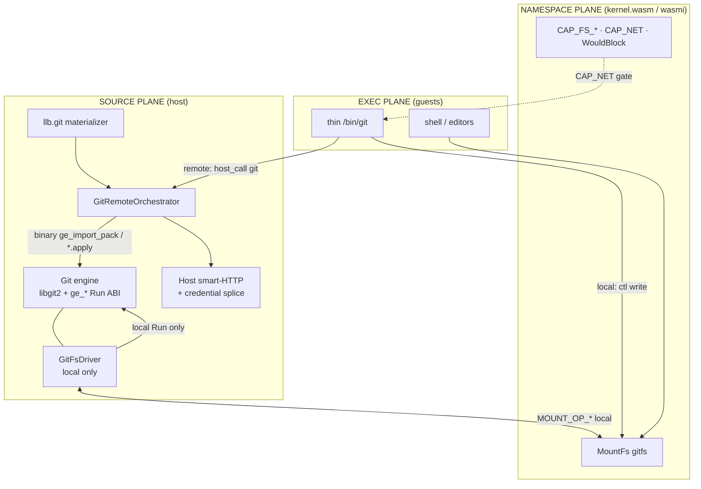
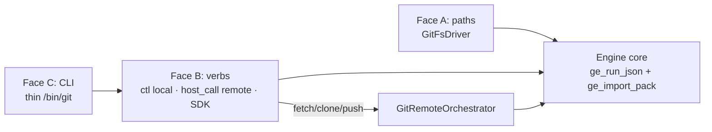
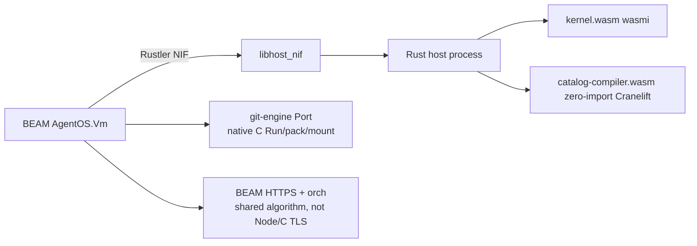
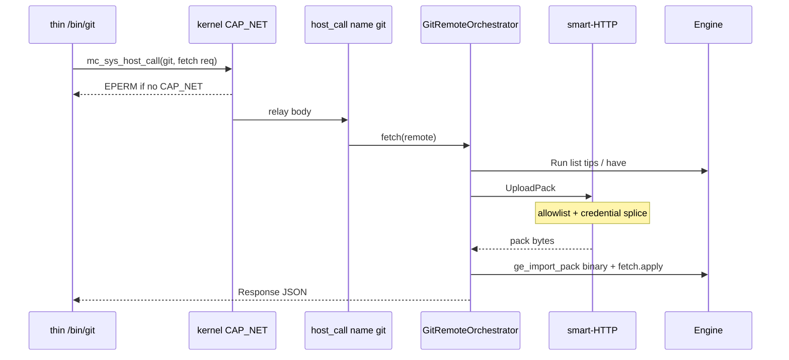
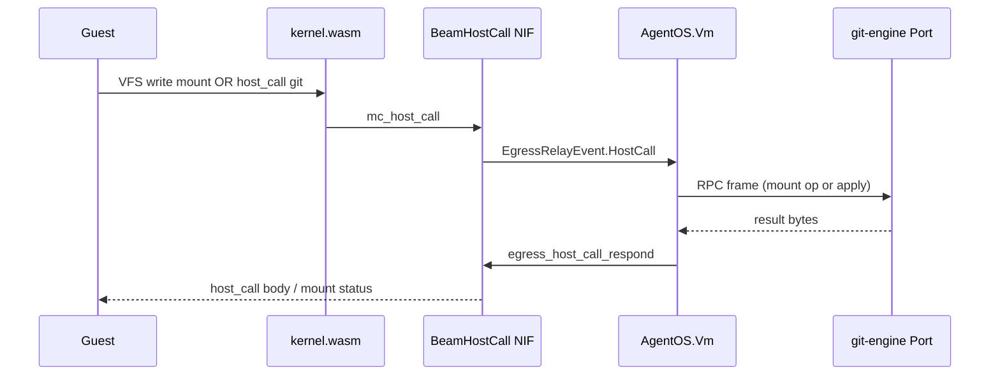

# AgentOS Git — Host Source Plane (libgit2)

| Field | Value |
|-------|--------|
| **Title** | AgentOS Git — Host Source Plane (libgit2) |
| **Author** | Design loop (AgentOS) |
| **Date** | 2026-07-30 (updated 2026-08-01) |
| **Status** | **Shipped** on `feature/cgit`. Product surface: [`docs/git.md`](docs/git.md). This file is the **design of record** and ABI notes for maintainers. |
| **Baseline systems** | `SYSTEMS.md` (Plan-9 VFS, MountFs, host-call, LLB, A1/A8/A9) |
| **Prior substrate** | go-git / gojs era designs superseded; product engine is **libgit2 + `ge_*`** |

Opt-in: `mc.create({ git: baseUrl })` or `mc.create({ git: { baseUrl, … } })` — presence enables; no boolean. Advanced surface (not multi-tenant default-on).

---

## Overview

AgentOS needs git for agents and humans: natural worktree paths under the Plan-9 VFS, a reduced CLI with shell muscle memory, durable history across reload, and remotes that respect the same capability/credential model as tools and netfs. A multi‑MiB VCS library as a **wasmi guest** fails cost (interpretation), concurrency (no second scheduler / asyncify), and memory (~2 GiB linear ceiling for large monorepos).

**Solution:** git is a **host source plane**. A **libgit2 1.9.x** engine behind a thin C **`ge_*` Run facade** owns the object DB and local porcelain. A **`GitFsDriver`** projects the worktree through existing `MountFs` + `mc_host_call` (local porcelain + paths only). A thin pure-mc **`/bin/git`** translates argv → local ctl verbs or CAP_NET-gated `host_call` name `git` for remotes. **Remotes are host-mediated** by a shared **`GitRemoteOrchestrator`** algorithm: host smart-HTTP + credential splice; engine only binary pack/ref apply.

| Host family | Engine runner |
|-------------|---------------|
| **JS (browser / Node)** | Emscripten `git_engine.js` + `git_engine.wasm` via `createGitEngineModule` (MODULARIZE, EXPORT_ES6 — **no gojs / no `wasm_exec.js`**) |
| **Server** | Native hermetic C **`git-engine` Port** (c-shared may package; **product load is Port**) — **not** freestanding wasm under wasmtime |

BEAM owns Port lifecycle and **server remote HTTPS orch**. **No Go NIF, no product Go for git.**



**One-line thesis:** paths and shell stay Plan-9-native inside the VM; git mechanics stay on the host next to LLB sources, catalog-compiler, and network/TLS — one engine ABI, host-appropriate runners, **libgit2 substrate**.

---

## Motivation (condensed)

| Constraint | Implication |
|------------|-------------|
| Agents need paths, not wire protocols | gitfs worktree + thin CLI |
| Wasm guest memory wrong for object stores | ODB on host; rebind on snapshot (A8) |
| wasmi interprets guests | Multi‑MiB engines stay off the guest path |
| LLB + sessions must not fork stacks | Shared remote/apply algorithm |
| Secrets never in guest | Origin allowlist + credential splice at host edge |
| CAP_NET gates egress (A9) | Mount/ctl alone is not network authority |
| go-git product path abandoned | Soft size multi‑MiB js wasm, gojs surface, rules_go cost; product is libgit2+emcc (~613 KiB measured) |

**Product constraints:** guest VFS holds **projected** repos; kernel never learns WASI or a git ABI; MCSN remains kernel state — host attachments rebind.

---

## Goals & Non-Goals

### Goals

1. Reduced, honest git surface for interactive sessions (local porcelain first).
2. One portable **function-face ABI** (`Run` / `ge_run_json`) shared by SDK, ctl, thin CLI, and apply ops.
3. **gitfs** via existing `MountFs` / `Driver` / `registerRaw` — no kernel git knowledge.
4. **Host-mediated remotes** only; engine never dials TLS or holds credentials.
5. Guest-initiated remotes require **CAP_NET**; mount write alone is insufficient.
6. **JS + server** runners with identical guest/CLI/SDK contracts.
7. Converge **`llb.git`** onto the same remote/apply substrate.
8. Deterministic tests via injectable author/time (`when_unix` on commit).
9. Size discipline: engine wasm **≤2 MiB**; thin guest CLI **≤256 KiB**.
10. Hermetic C packaging in monorepo (emsdk + hermetic_cc for git-engine only).

### Non-Goals

- Full git-core / libgit2 parity.
- Kernel WASI, git ABI, or Component Model for this feature.
- Production multi‑MiB **wasmi guest** VCS engines.
- Stock `wasm_exec.js` / gojs as product artifacts.
- Zero-import pure `f(bytes)→bytes` for all of git.
- Replacing developer or Bazel monorepo git on the AgentOS machine.
- Multi-writer concurrent libgit2 on one mount.
- Go-as-Erlang-NIF / any product Go git engine.
- Ambient host `~/.git-credentials` injection into the engine.
- **Objects façade** under `.git/objects` in v1 (synthetic HEAD/refs/ctl only).
- Freestanding zig wasm32 as JS product path (emcc is JS primary).

---

## Architecture

### 1. Planes and faces

| Plane | Responsibility |
|-------|----------------|
| **Source (host)** | Engine (libgit2 + `ge_*`), durable packs, `GitRemoteOrchestrator`, smart-HTTP, LLB source ops, SDK `GitEngine` |
| **Namespace (kernel)** | `MountFs` slot, `CAP_FS_*` / `CAP_NET`, cooperative `WouldBlock`, snapshot gating on inflight host_call |
| **Exec (guest)** | Shell, editors, thin `/bin/git` |

Three faces over **one** engine core for **local** ops; remotes add orchestration **outside** the engine:



**Rule:** commands are a shell adapter, not the internal ABI.

```text
┌─ JS host (browser · Node) ─────────────┐  ┌─ Server host (Elixir → NIF → Rust) ─────┐
│  git_engine.js + git_engine.wasm       │  │  native hermetic C                      │
│  createGitEngineModule (emcc)          │  │  git-engine Port (c-shared packaging ok)│
│  GitFsDriver · host-mediated remotes   │  │  BEAM HTTPS orch + Port apply           │
└──────────────────▲─────────────────────┘  └──────────────────▲──────────────────────┘
                   │  ge_run_json + mount codec · same contract │
                   └────────────────────┬──────────────────────┘
                                        │ mc_host_call
┌───────────────────────────────────────▼─────────────────────────────────────────────┐
│  kernel.wasm (wasmi)                                                                │
│   MountFs gitfs · thin /bin/git · shell/editors on the same mount                   │
└─────────────────────────────────────────────────────────────────────────────────────┘
```

### 2. Component map

| Component | Monorepo location | Role |
|-----------|-------------------|------|
| Engine (C) | `memcontainers/lib/git-engine/` | libgit2 + `ge_*` Run ABI; `git_engine_wasm` + `libgit_engine` / static |
| libgit2 + patches + license | `third_party/libgit2/` | Pin **1.9.2**; HTTPS/SSH off by default; emscripten integer patch; NOTICE / corresponding source |
| Bazel helpers | `//bazel/wasm_opt.bzl`, `//bazel/tools/size:size_limit`; `force_opt` for emcc | force_opt → emcc -Os → wasm-opt -Oz → size_limit |
| `GitEngine` + orchestrator + `GitFsDriver` | `memcontainers/sdk-js/core/src/git/` | TS: loader, orchestrator, mount driver |
| Thin `/bin/git` | `memcontainers/programs/git/` | Pure-mc Zig |
| Server engine Port | Native C `git-engine` binary; BEAM-owned Port (ad-hoc `Port.open`, not full sidecar lifecycle) | Length-prefixed RPC frames type 1–4 |
| Server remotes | BEAM HTTPS + Elixir orch (same algorithm as TS; golden traces) | No Node on server; no C TLS |
| Elixir Port owner | `server/lib/agent_os/git_engine.ex` + hooks in `vm.ex` / `control_plane.ex` | Start/stop Port with VM; `egress_host_call_respond` |
| ABI fixtures | `memcontainers/lib/git-engine/testdata/abi/` | Golden JSON for dual-runner conformance |
| License notices | `third_party/libgit2/NOTICE`, upstream COPYING*, `//third_party/libgit2:corresponding_source` | Linking-exception compliance |

### 3. Engine ABI (normative)

```c
/* ge_engine ≈ one gitfs mount. Paths in args are worktree-relative; no dial.
 *
 * ge_open(worktree_root):
 *   - worktree_root MUST be an absolute path (native) or absolute MEMFS path (emcc).
 *   - The directory MUST already exist; ge_open does not mkdir.
 *   - Does not create a repository until op "init" (open existing repo if present).
 *   - One ge_engine instance ≈ one gitfs mount / one worktree root.
 */
typedef struct ge_engine ge_engine;

ge_engine *ge_open(const char *worktree_root);
void       ge_close(ge_engine *e);
char      *ge_run_json(ge_engine *e, const char *request_json); /* free with ge_free */
int        ge_import_pack(ge_engine *e, const uint8_t *chunk, size_t len, int final);
const char *ge_last_error(const ge_engine *e);
void       ge_free(void *p);
const char *ge_version(void);
```

**`GitEngine.load`:** host glue creates/ensures the worktree directory (emcc: `Module.FS.mkdirTree("/work")` or durable mount path; native: real absolute directory), then calls `ge_open` with that absolute path. Callers never pass relative roots.

#### 3.1 Request / Response (JSON)

```json
// Request — {op, args} only (no top-level cwd/author)
{ "op": "commit", "args": { "message": "initial", "all": false,
  "name": "Agent", "email": "agent@example.com", "when_unix": 1700000000 } }

// Response
{ "ok": true, "code": 0, "stdout": "[abc1234] initial\n…", "stderr": "",
  "result": { "hash": "abc1234…" } }
```

| Field | Meaning |
|-------|---------|
| `code` | `0` ok, `1` operational error, `2` usage / unknown op / bad JSON |
| Author/time | In op-specific args or engine defaults — **not** top-level request fields |

Optional `abi_version` reserved for future breaks; v1 omits it (implied 1). Product builds use growable JSON/args buffers (no fixed small content caps as defaults).

#### 3.2 Ops surface

| Class | Ops |
|-------|-----|
| **Local porcelain** | `init`, `status`, `diff`, `add`, `rm`, `commit`, `log`, `show`, `branch`, `checkout`, `switch`, `reset`, `rev-parse`, `tag`, `config`, `remote` (config only: list/add/remove URL), `write` (host/engine test helper — optional for SDK, not thin CLI) |
| **Apply (network-free)** | `refs.import`, `pack.import` (metadata only in JSON), `clone.apply`, `fetch.apply`, `push.prepare`, `push.complete` |
| **Forbidden in product** | Any op that dials: `clone` / `fetch` / `pull` / `push` that open sockets — **always** `code:1`, stderr mentions host-mediated remotes |

Unknown `op` → `code: 2`, fail closed. Dial refuse for network-shaped ops is part of the ABI contract.

#### 3.3 Binary pack path

JSON `Run` **must not** carry multi‑MB pack payloads as base64/string fields.

| API | Transport | Payload |
|-----|-----------|---------|
| `ge_run_json` / `Engine.Run` | JSON | Metadata, refs lists, small results |
| `ge_import_pack(chunk, len, final)` | **Binary** (native / RPC frame type `pack`) | Raw pack bytes via `git_indexer_*` |
| Finalize | last chunk with `final!=0` or `Run(pack.import)` meta | Then `clone.apply` / `fetch.apply` without embedded packs |

| Limit | Default |
|-------|---------|
| Max single pack import (interactive) | **64 MiB** total before reject |
| Max single JSON `Run` args size | **1 MiB** |
| Max `stdout` returned in one Response | **1 MiB** (overflow → truncated + `result.truncated=true` or full body on ctl out) |

#### 3.4 Invariants

1. **Single ABI** — local faces map into `Run` / `ge_run_json`; packs use `ge_import_pack`.
2. **One engine instance per gitfs mount** — FIFO single-writer queue on the host driver.
3. **Path safety** — worktree-relative; reject absolute and `..` (`ge_safe_relpath` pattern).
4. **JSON args fail closed** — decode errors → code 2.
5. **Injectable clock + author** for deterministic tests (`when_unix`, name, email).
6. **No product network dial** in engine; libgit2 HTTPS/SSH backends **compile-time off**.
7. **VFS hooks** for mount driver — worktree files via engine FS (emcc `Module.FS` on JS; native paths on server).

### 4. Engine runtimes (normative packaging)

| Host family | Preferred engine runner | Artifact |
|-------------|-------------------------|----------|
| **Browser / Node** | **Emscripten** `createGitEngineModule` | `git_engine.js` + `git_engine.wasm` |
| **Server / remote** | **Native hermetic C** (zig cc) Port | `git-engine` binary and/or `libgit_engine.so`; length-prefixed RPC |

| Option | Status |
|--------|--------|
| **Native C subprocess Port** | **Server product load (chosen)** — isolation, crash containment |
| **Native C c-shared in-process** | **Packaging only** (`:libgit_engine` may ship). Product load is Port |
| Freestanding ge_* under wasmtime | **Rejected** |
| wasmi guest libgit2/go-git | **Rejected** |
| Go NIF / go-git product | **Rejected** |

**Invariant:** guest, gitfs codec, thin `/bin/git`, and host-mediated remotes **do not care** which runner is active. Only the host’s `GitEngine` handle changes.



#### 4.1 Emscripten (JS packaging)

```text
force_opt
  → emcc -Os → MODULARIZE=1 EXPORT_ES6=1 EXPORT_NAME=createGitEngineModule
  ENVIRONMENT=web,worker,node ALLOW_MEMORY_GROWTH FILESYSTEM=1
  EXPORTED_FUNCTIONS=@ge_* only (not full git_*)
  → //bazel/wasm_opt.bzl (-Oz)
  → //bazel/tools/size:size_limit ≤2 MiB
```

Exported symbols (allowlist): `_malloc`, `_free`, `_ge_open`, `_ge_close`, `_ge_run_json`, `_ge_import_pack`, `_ge_last_error`, `_ge_free`, `_ge_version`.

Runtime methods for host glue: `ccall`, `cwrap`, `UTF8ToString`, `stringToUTF8`, `HEAPU8`, `FS`, `PATH`, etc.

```js
import createGitEngineModule from "./git_engine.js";
const Module = await createGitEngineModule({ locateFile: … });
// Module._ge_open / _ge_run_json / Module.FS
```

**No gojs. No stock `wasm_exec.js`.**

#### 4.2 Native hermetic path

- **Toolchain:** `hermetic_cc_toolchain` (zig cc) — **scoped to git-engine package transitions only**. Do not re-register as default C++ for the whole monorepo.
- **Backends:** HTTPS/SSH **off** by default (assert via copts / `select()` / build flags — L6).
- **Artifacts:** `//memcontainers/lib/git-engine:git_engine_lib`, `:libgit_engine` (`.so`), thin `git-engine` binary for BEAM Port.

#### 4.3 Size budgets

| Measurement | Value |
|-------------|--------|
| Emcc `git_engine.wasm` (after wasm-opt) | **627 769 B ≈ 613 KiB** (measured) |
| Soft gate emcc product CI | **≤ 2 MiB** |
| Thin `/bin/git` | **≤ 256 KiB** post-opt |
| Max interactive pack import | **64 MiB** |
| Max JSON Run args | **1 MiB** |

`git_engine.{js,wasm}` is a **host** artifact (like catalog-compiler), not required inside every guest image tar. **libgit2 pin:1.9.2** (BCR + `emscripten_integer.patch`).

### 5. gitfs / MountFs integration

#### 5.1 Substrate

- Kernel: `memcontainers/kernel/rust/src/fs/mountfs.rs` — whole-file open, commit buffer on **Drop**, last-writer-wins, **not POSIX**; `WouldBlock`; pending Drop commits best-effort.
- Constants: `MOUNT_OP_OPEN`…`MOUNT_OP_WRITE` in `contracts/gen/constants.gen.*`.
- SDK: `embedded.ts` `registerRaw(path, body => dispatchMount(driver, body))`; `mount.ts` `dispatchMount`; `Driver` in `types.ts`.
- Docs: `docs/mounts-drivers.md`.

#### 5.2 Projection layout (v1)

```text
/workspace/{name}/                    worktree (default convention; path configurable)
/workspace/{name}/.git/HEAD           synthetic text
/workspace/{name}/.git/refs/…         synthetic ref tips (optional read)
/workspace/{name}/.git/mc/ctl         ctl request/response
/workspace/{name}/.git/mc/out/last    alias: last response body (always full Response JSON)
/workspace/{name}/.git/mc/generation  decimal generation counter (read-only text)
```

**v1:** no `.git/objects` façade. Tools that require a real on-disk git dir are out of surface.

#### 5.3 Ctl protocol (normative)

MountFs only supports whole-file `open`/`write` (driver `write(path, data)` after guest Drop). Ctl must work with that.

| Path | Kind | Behavior |
|------|------|----------|
| `/.git/mc/ctl` | file | **Write:** full request JSON; driver runs verb **synchronously inside `write()`** before returning host_call success. **Open/read:** returns last **Response** JSON. |
| `/.git/mc/out/last` | file | Read-only copy of last Response JSON (or stream body when truncated). |
| `/.git/mc/generation` | file | Monotonic `u64` decimal; increments on each completed ctl `write`. |

**Only local ops** on ctl. Remote ops on ctl → Response `{ ok:false, code:1, stderr:"use host_call git for remotes" }`. Prefer Response over errno so thin CLI can print stderr. (Write host_call status 0; Response.ok false.)

**Why Run inside `write()` not Drop:** MountFs parks guest writes and commits on Drop with **best-effort** host ack (`pending_commits` drained on the next mount op and on `mc_tick`). Ctl must return a structured result; therefore the driver handles ctl on the **MOUNT_OP_WRITE** that carries the full buffer.

```text
# thin CLI / guest — local porcelain
1. open(O_WRONLY|O_TRUNC)  /.git/mc/ctl
2. write(requestJSON) ; close()     # Drop parks MOUNT_OP_WRITE; not yet guaranteed drained
3. open(O_RDONLY) /.git/mc/ctl  (or /.git/mc/out/last)
   # open issues a new mount op → drain_commits runs → driver.write executes Run
4. read(responseJSON) ; parse code/stdout/stderr ; exit(code)
```

**Drain / read-after-write invariant:**

1. After ctl write+close, the **next** open/read of `/.git/mc/ctl` or `/.git/mc/out/last` **must** observe the Response for that write (generation advanced by exactly one for that writer’s completion).
2. Thin CLI **must not** assume synchronous host ack on close alone; it **must** issue a following open/read that triggers MountFs drain (product thin CLI always does open/read, never close-only).
3. Failure mode if drain lags or a second writer interleaves: generation mismatch → retry open/read once; if still wrong, fail closed with stderr `git: ctl race` / code 1.

**Single-writer queue:** all `ge_run_json`, worktree mutating FS ops, and ctl writes share one FIFO per mount. Optional `args.client_token` echoed in `result.client_token`; `generation` detects response races.

**Large stdout:** if embedded `stdout` would exceed **1 MiB**, set `stdout` to a preview, `result.truncated=true`, `result.stream_path=".git/mc/out/last"`, and write the full body (cap **8 MiB**) to worktree `/.git/mc/out/last`. Hosts read that path via gitfs open or `GitEngine.readStdoutStream(resp)`. When body exceeds 8 MiB, `stream_partial=true` and `stream_bytes` reflect the written prefix. `/.git/mc/ctl` always returns Response JSON; `out/last` is the stream body when present, else a Response alias.

| Case | Behavior |
|------|----------|
| Invalid JSON / unknown op | Store Response code 2; write host_call ok |
| Engine error | Response code 1; stderr message |
| Read-only mount | Mutating ops → Response code 1 or driver EACCES |
| Remote op on ctl | Response code 1; **no network** |
| Engine runner dead (server) | driver.write throws → guest EIO |

#### 5.4 Worktree coherence (MountFs last-writer-wins)

1. Engine worktree / index reflects only **completed** driver `write` / `unlink` / `rename` / `mkdir` ops.
2. Guest FDs with unflushed buffers are **invisible** to `git status` until close/Drop — **same class as `hostDir`**. Document for agents/editors.
3. `git status` after close agrees with engine content — product acceptance for gitfs.
4. Single-writer queue: `git add` and worktree `write` serialize on the engine.
5. **Monorepo / large files:** full-file RMW cost is inherent to MountFs; mitigate with sparse cones (phase B).

#### 5.5 Attach

```ts
// Product attach is usually mc.create({ git: { baseUrl, … } }); advanced:
const engine = await GitEngine.load({ baseUrl: "…/git-engine/", /* durableDir? durable? */ });
await vm.mount("/workspace/my-app", engine.asMountDriver(), { readOnly: false });
// Default convention: /workspace/{name}; configurable per session.
```

| Concern | Behavior |
|---------|----------|
| Everyday I/O | Map to engine worktree (emcc FS / native path) |
| Local porcelain | Ctl protocol |
| Read-only | Reject mutating ctl + write methods |
| Single-writer | FIFO |
| Bytes only | A1 — never host handles to guest |
| Snapshot | In-flight host_call → inflight_egress blocks snapshot |

### 6. Thin `/bin/git` (guest)

| Item | Choice |
|------|--------|
| Implementation | Freestanding Zig pure-mc (`memcontainers/programs/git`) |
| Local ops | Ctl protocol only (`CAP_FS_WRITE`) |
| Remote ops | `mc_sys_host_call` with name **`git`** + Request JSON body — kernel gates with **CAP_NET** |
| Size budget | **≤ 256 KiB** post-opt (soft CI gate) |

**Mount selector (normative v1):**

| Rule | Detail |
|------|--------|
| **One gitfs engine per mount path** | Multi-mount allowed with **distinct** paths. Same path remount/re-attach fails closed. Single-writer **per engine**. |
| Guest remote host_call | Request is still `{ "op", "args" }`. **`args.mount` or top-level `mount`** demuxes to the engine for that path. Empty mount → default/sole engine. Unknown mount → code 1. |
| Thin CLI discovery | Walk parents for `/.git/mc/ctl` |
| Multi-repo | One Port/process (or JS engine) per mount; demux on host_call `"git"` — never share mutable engine across mounts without lock/demux |

```text
# Local
git commit -m M
  → find gitfs root (walk for /.git/mc/ctl)
  → write Request { "op":"commit", "args":{ "message":"M" } } to ctl
  → read Response → print stdout/stderr → exit(code)

# Remote
git fetch origin
  → require CAP_NET
  → mc_sys_host_call("git\0" + Request{ "op":"fetch", "args":{ "remote":"origin" } })
  → host routes to GitRemoteOrchestrator
  → read result fd → exit(code)
```

Unknown commands fail closed. Meta: `version`, `help`.

### 7. Host-mediated remotes + orchestration

#### 7.1 Model

Remotes are a **host service** that turns `(URL or connection ref, policy, credentials)` into **pack bytes + ref tips**. The git engine is a **pure object database** that applies those bytes. The guest sees only paths + thin CLI verbs — never TLS, never tokens.

```text
┌──────────────── HOST ─────────────────┐     ┌──────── ENGINE (libgit2) ─────────┐
│  Policy · CAP_NET · origin allowlist  │     │  objects · refs · index · tree    │
│  TLS / smart-HTTP · auth splice       │     │  NO sockets · NO secrets          │
│  ListRefs · UploadPack · ReceivePack  │     │  pack.import · refs.import · …    │
└───────────────────┬───────────────────┘     └────────────────▲─────────────────┘
                    │  bytes only (packs, ref lists, status)   │
                    └──────────────────────────────────────────┘
```

#### 7.2 `GitRemoteOrchestrator` (logical module)

**Logical contract** is one: ordered steps, defaults, and error codes below. **Implementations:**

| Host | Orchestrator + smart-HTTP | Engine apply |
|------|---------------------------|--------------|
| **JS (browser/Node)** | TypeScript in `sdk-js/core/src/git/{remote-orchestrator,smart-http}.ts` | In-process emcc `ge_run_json` / `ge_import_pack` |
| **Server (Elixir control plane)** | **BEAM HTTPS + Elixir orchestrator** (OTP `:httpc`/ssl — same host egress family as kernel HTTP; **no Node, no C TLS**) | Native C `git-engine` Port: apply only |

**:TS only on the JS host family**. **Server remotes: BEAM owns smart-HTTP + orchestrator**. C `git-engine` stays dial-free. Dual-host drift is mitigated by a **shared algorithm spec + golden traces** (TS orch ↔ Elixir orch), not by putting TLS in the Port child.

```text
AgentOS.Vm (BEAM)
  ├─ HTTPS smart-HTTP + orch (ListRefs / FetchPacks / PushPacks)
  │     credential splice + origin policy (connections)
  └─ Port → git-engine (native C, no network)
         ├─ Run / ImportPack / binary MOUNT_OP type-4
         └─ apply only (pack.import / refs.import / clone.apply / …)
```

| Entry | Path |
|-------|------|
| SDK `GitEngine.clone/fetch/push` (JS) | Direct call into TS orchestrator |
| Guest remote via host_call `git` (JS embedded) | **`MapHostCall.register("git", …)`** → TS orchestrator — **not** catalog-only |
| Guest remote via host_call `git` (Elixir) | `BeamHostCall` → BEAM → **BEAM HTTPS orch** → Port apply frames |
| Ctl / GitFsDriver | **Does not** run remotes (fail closed) |
| LLB | Same algorithm; host language per solve platform |

Catalog tool `git run` is **not productized**. Remotes use host_call `"git"` only.



#### 7.3 Orchestrator algorithm (normative)

Both TS and server implementations **must** follow these steps and map failures to the same `Response.code` / stable `stderr` prefixes. Ship optional golden **trace** fixtures (ordered step names).

**Defaults:** shallow `depth=1` unless args override; `single_branch=true` for clone; public HTTPS only until connections wiring; max pack **64 MiB** interactive; engine never dials.

**Shallow clone** (`op: "clone"` at orchestrator; engine sees only apply ops):

1. `policy.check_origin(url)` — deny → code 1, `git: origin denied`
2. `http.ListRefs(url)` — fail → code 1, `git: list-refs failed: …`
3. Select want tip; have=[]
4. `http.FetchPacks(url, want, have, depth)` — oversize → `git: pack too large`
5. `engine.ImportPack` / `ge_import_pack` (binary chunks) until complete
6. `engine.Run(refs.import)` / remote-tracking as needed
7. `engine.Run(clone.apply)` metadata only (HEAD + checkout branch)
8. Return Response ok with `result.head`

**Fetch:** resolve remote → check origin → list local have → ListRefs + FetchPacks → ImportPack + `fetch.apply`.

**Pull v1:** fetch then local fast-forward only (no rebase); FF fail → `git: not fast-forward`.

**Push:** check origin + optional approval → ListRefs for lease → `push.prepare` → host pack stream + `PushPacks` → `push.complete`.

**Error codes:** `0` ok, `1` operational, `2` usage. No tokens in stderr.

#### 7.4 CAP_NET enforcement

| Initiator | Network allowed when |
|-----------|----------------------|
| Guest thin CLI / guest code | Kernel **`CAP_NET`** on `mc_sys_host_call` only. Mount/ctl **must not** start smart-HTTP. |
| Embedder SDK on host | Host policy (`net: true` / connections); no guest cap |
| LLB solve | Solve platform policy (host) |

**Why not ctl + mount write:** MountFs host_calls are gated by `CAP_FS_WRITE`, **not** `CAP_NET`. Treating ctl as network authority would violate A9.

**Acceptance:** guest without CAP_NET receives EPERM on `git fetch`; with CAP_NET + public HTTPS, shallow fetch works; ctl `{"op":"fetch"}` never dials.

#### 7.5 Host remote port

```text
ListRefs(ctx, remoteURL) → RefAdvertisement
FetchPacks(ctx, remoteURL, want[], have[], depth) → PackBundle (binary)
PushPacks(ctx, remoteURL, commands[], packStream) → ReceiveStatus
```

Do not depend long-term on system `git`. Node LLB may use system git only as transitional emergency (`MC_GIT_USE_SYSTEM=1`).

#### 7.6 Credentials

| Rule | Detail |
|------|--------|
| Secrets never in guest | CLI sends remote **name** or public URL |
| Connection refs | `remote.origin.agentos = github.user.work` |
| Origin allowlist | Exact match before splice |
| Destructive push | Optional `require_approval` |
| Read-only gitfs | Reject push |
| No ambient developer git | Never read `~/.git-credentials` into engine |

```text
remote.origin.url = https://github.com/org/repo.git    # public locator
remote.origin.agentos = github.user.work               # optional connection id
```

### 8. Server / Elixir integration

**Single normative wire:** for control-plane VMs, **BEAM owns host_call answers and the engine child**. Rust NIF / `BeamHostCall` only **relays** — it does not open the C subprocess or answer mount/`git` itself.

#### 8.1 Ownership tree

| File | Role |
|------|------|
| `server/lib/agent_os/git_engine.ex` | Port owner: start/stop `git-engine`, length-prefixed RPC encode/decode, crash → fail handles |
| `server/lib/agent_os/vm.ex` | Wire gitfs attach/detach to Port lifecycle; GenServer callbacks for host_call demux |
| `server/lib/agent_os/control_plane.ex` | Existing `egress_host_call_respond` / `egress_host_call_fail` — no new NIF |
| Firecracker helper.ex | **Pattern reference only** (`Port.open`) — git-engine is an **ad-hoc Port**, not a full sidecar provider |
| `memcontainers/lib/git-engine/` | `cc_binary` git-engine main |

```text
AgentOS.Vm (BEAM process)                    ← one owner per VM
  ├─ NIF KernelHost (DirtyCpu): boot/tick/snapshot/mount table
  │     host_call capability = BeamHostCall  → events to BEAM
  ├─ Port → git-engine (native C)            ← AgentOS.GitEngine
  │     stdin/stdout: length-prefixed RPC
  │     Run / pack / binary MOUNT_OP only (no network in child)
  ├─ Git session state (Elixir): mount_path, durable opts, connection policy refs
  └─ On EgressRelayEvent::HostCall { name, body, handle }:
        if name is absolute path and path is this VM's gitfs mount
           → binary MOUNT_OP type 4 to git-engine
           → egress_host_call_respond(handle, result_bytes)
        else if name == "git"
           → BEAM smart-HTTP + orch (HTTPS) → Port import/apply
           → egress_host_call_respond(handle, Response JSON)
        else
           → existing tool/sidecar handling (unchanged)
```

| Item | Spec |
|------|------|
| Engine binary | `git-engine` — Run / ImportPack / mount codec only (dial-free) |
| Remote orch | **BEAM HTTPS + Elixir orch**; browser/Node uses TS |
| Protocol (engine Port) | Length-prefixed frames: `u32le length \| u8 type \| payload` — type **1** = JSON Run; type **2** = pack chunk; type **3** = pack meta; type **4** = **binary MOUNT_OP**. |
| Protocol (remote) | BEAM routes host_call `"git"` → BEAM smart-HTTP → Port apply; **no Node orch** |
| Who starts/stops children | **BEAM `AgentOS.Vm`** via `AgentOS.GitEngine` when first gitfs mount attaches (or at boot if declared); **stop on VM stop/crash/terminate** |
| Who holds child stdio | **BEAM** (Port). Not the Rust NIF. |
| Who answers host_call | **BEAM** via existing `egress_host_call_respond` / `egress_host_call_fail` |
| Crash | Port exit → BEAM fails in-flight handles; subsequent git ops → guest **EIO** |
| Go NIF / go-git child | **Rejected** |



#### 8.2 Where logic lives by deployment

| Deployment | Engine process | Who answers mount host_call | Who answers name `git` |
|------------|----------------|----------------------------|-------------------------|
| **JS embedded** | in-process emcc wasm | Same JS `MapHostCall` + `dispatchMount(GitFsDriver)` | **`MapHostCall.register("git")`** → TS orchestrator (CAP_NET) |
| **JS remote SDK** | **Client-side** engine | Client `drivers` map + unified WS `hostCall` | Client registers raw name `"git"` the same way |
| **Elixir control plane** | **Server** `git-engine` **owned by BEAM** (apply only) | BEAM → Port type 4 binary MOUNT_OP | BEAM HTTPS orch → Port apply |

Browser never runs the native C subprocess; browser uses emcc wasm.

#### 8.3 NIF surface

| Change | MVP? |
|--------|------|
| New git-specific NIF exports | **No** |
| Existing boot/tick/snapshot/mount/egress relay | **Yes** |
| `BeamHostCall` | **Yes** — remains sole server host_call capability for control-plane VMs |
| Composite Rust intercept for gitfs path and `git` | **No** (deferred) |

### 9. State, snapshots, durability

| State | Location | In MCSN? |
|-------|----------|----------|
| Mount table gitfs slot | kernel | yes |
| Object DB, packs | host engine / OPFS / disk | **no** — reattach |
| Dirty worktree | host until completed write | **no** |
| Thin `/bin/git` | image | yes |
| In-flight host_call | host handle | snapshot blocked |

**Product rule (A8):** snapshotting a coding agent does not silently include a full object database unless the embedder also persists and rebinds the engine’s durable backend. Same class as persistfs/netfs/tools.

| Host | Store |
|------|--------|
| Browser | OPFS / IndexedDB packs + loose objects |
| Node | Directory or pure memory for tests |
| Remote server | Disk via native engine store |

### 10. LLB alignment

Target: same orchestrator algorithm + engine apply path. Interactive gitfs and `llb.git` share one host git substrate (same fetch/checkout/object access), not two stacks. `OP_GIT = 15` grammar unchanged. Node solve is engine-first; system git is emergency only.

| LLB | Interactive AgentOS |
|-----|---------------------|
| Solver resolves Git | Host engine / durable store |
| Result is a tree | `gitfs` worktree projection |
| Exec does not embed full git | Guest uses paths + thin CLI |
| Cache identity on content | OPFS/disk + reattach; LLB cache remains host-side |

### 11. Reduced command surface

Honest reduced CLI — **not** git-core parity. Unknown commands fail closed. Product command list: [`docs/git.md`](docs/git.md).

| Phase | Surface |
|-------|---------|
| **A — local porcelain** | `init`, `status`, `diff`, `add`/`rm`, `commit`, `log`/`show`, `branch`, `checkout`/`switch`, `reset`, `rev-parse`, `tag`, limited `config`, `remote` (config) |
| **B — monorepo materialization** | Shallow history (`depth`) + cone sparse worktree + optional pack `filter` — host-side; guest sees projected worktree |
| **C — remotes (host-mediated)** | `clone` / `fetch` / `pull` / `push` via host smart-HTTP + engine apply only |

**Out of surface:** interactive rebase, bisect, LFS, worktrees-as-git-feature, full credential helpers, `git gui`, server-side `git receive-pack` as a guest service, replace of developer/Bazel monorepo git.

---

## API / Interface Changes

### SDK (TypeScript)

```ts
// memcontainers/sdk-js/core/src/git/

export interface GitRequest {
  op: string;
  args?: unknown;
}

export interface GitResponse {
  ok: boolean;
  code: number;
  stdout?: string;
  stderr?: string;
  result?: unknown;
}

export interface GitEngine {
  run(req: GitRequest): Promise<GitResponse>;
  /** Binary pack import — not via run() JSON */
  importPack(chunk: Uint8Array, meta: PackChunkMeta): Promise<void>;
  asMountDriver(): Driver;
  clone(url: string, opts?: CloneOptions): Promise<GitResponse>;
  fetch(remote?: string): Promise<GitResponse>;
  push(remote?: string, opts?: PushOptions): Promise<GitResponse>;
  close(): Promise<void>;
}

// Load: createGitEngineModule from git_engine.js (emcc); ensure absolute worktree; ge_open(absPath).
// static load(opts: GitEngineLoadOptions): Promise<GitEngine>;
// opts: { baseUrl, workRoot?, readOnly?, sparseCone?, durable?, durableDir?, identity? }
// Product path: mc.create({ git: baseUrl | { baseUrl, mounts?, durable?, … } })
```

| Face | Registration | Consumer | Cap |
|------|--------------|----------|-----|
| **Raw host_call name `"git"`** | `MapHostCall.register("git", handler)` | Thin `/bin/git` remote subcommands via `mc_sys_host_call` | **CAP_NET** |

```ts
// Normative remote path (JS embedded) — raw host_call name only:
backend.tools.register("git", (argsJson) =>
  orchestrator.handleGuestRequest(JSON.parse(argsJson)),
);
```

**Implementer trap:** host_call name `"git"` is **required** for thin CLI remotes. Catalog tools are not a substitute.

Elixir control plane: BEAM handles name `"git"` and gitfs mount path via **BEAM HTTPS orch** + Port apply.

### Guest / Kernel / Host

| Layer | Contract |
|-------|----------|
| **Guest** | `/bin/git` pure-mc; local → ctl; remote → host_call `git`. No new syscalls. |
| **Kernel** | No MountFs codec change. Remotes use existing CAP_NET on `mc_sys_host_call`. |
| **Host JS** | Emcc modularize glue only; no gojs. `MapHostCall.register("git")` for guest remotes. |
| **Host NIF / Elixir** | `BeamHostCall` relay only; **BEAM owns** `git-engine` Port and `egress_host_call_respond` for mount path + `git`. No new NIF exports. |
| **LLB** | `SolvePlatform.gitSource` → orchestrator algorithm; grammar unchanged (`OP_GIT = 15`). |

### Data model

Engine session (host): libgit2 `git_repository`, worktree root, index, limited cfg, sparse cones, optional streaming `git_indexer`. Durable: content-addressed packs/objects; refs; config without secrets. No MCSN schema change. Credentials only as connection id references in config.

---

## Security & Privacy

### Threat model

| Threat | Mitigation |
|--------|------------|
| Guest steals credentials | Splice only; no tokens in ctl/host_call JSON |
| Guest triggers network with only CAP_FS_WRITE | **Ctl remotes forbidden**; remotes via CAP_NET host_call |
| Path traversal | SafePath + mount-relative paths |
| Multi-writer corruption | Single-writer FIFO |
| Pack bombs | 64 MiB default cap; fail closed |
| SSRF | Origin allowlist + connections |
| Snapshot secret inclusion | No secrets in engine durable store |
| License compliance risk | Ship notices + corresponding source of libgit2 + monorepo patches |

### Capabilities

| Concern | Rule |
|---------|------|
| Worktree / local ctl | `CAP_FS_READ` / `CAP_FS_WRITE` |
| Guest remotes | **`CAP_NET`** via `mc_sys_host_call` |
| Read-only mount | Reject mutating verbs + push |
| Snapshot | Refuse while host_call in flight |
| gitfs content | Not a trust boundary for elevating CAP_NET |

Aligns A1, A8, A9.

### License (libgit2) — packaging checklist

libgit2 is **GPL-2.0 with linking exception** (upstream).

#### Obligations

1. Ship copyright/notice files for libgit2 and applied patches in **every** release artifact set that includes the engine.
2. Provide **corresponding source** of the pinned libgit2 version + monorepo patches.
3. Engine facade and AgentOS packaging remain under the monorepo license (Apache-2.0 for the facade) **without** claiming the exception covers unrelated code.
4. Do not enable network backends that pull in OpenSSL under conflicting terms without a separate license review.

#### Packaging checklist (normative)

| # | Deliverable | Detail |
|---|-------------|--------|
| **L1** | `third_party/libgit2/NOTICE` | libgit2 name, version **1.9.2**, upstream URL, “GPL-2.0 with linking exception,” monorepo patches (e.g. `emscripten_integer.patch`). |
| **L2** | Upstream license texts | Vendored from libgit2 **1.9.2**: `COPYING`, `COPYING.LGPL` (or files that tag ships). Path: `third_party/libgit2/upstream/`. |
| **L3** | `//third_party/libgit2:corresponding_source` | Pinned source (or URL+sha256 + patches) **and** monorepo patches. Publish in release as e.g. `libgit2-1.9.2-agentos-source.tar.gz`. |
| **L4** | Artifacts that embed/link NOTICE | (a) JS package shipping `git_engine.{js,wasm}`; (b) `libgit_engine.so`; (c) `git-engine` binary; (d) any web bundle that embeds the wasm. NOTICE adjacent or in release `THIRD_PARTY/`. |
| **L5** | CI gate | Build/test fails if release package for git engine **omits** `NOTICE` + upstream COPYING*. |
| **L6** | HTTPS/SSH off assert | Product engine targets: copts / `select()` ensuring HTTPS/SSH remain **off**. Enabling OpenSSL backends is a separate design+license review. |

License packaging freezes L1–L6 on the product ship path.

---

## Observability

| Layer | Metrics / logs |
|-------|----------------|
| Engine | op, duration, code, sizes — no packs/tokens |
| Orchestrator | origin, status, bytes, depth; redact Authorization |
| Mount | queue depth, latency |
| Subprocess | restarts, RPC errors |
| Size | CI soft gates (wasm ≤2 MiB; guest CLI ≤256 KiB) |

**Alert (server):** push failures, allowlist denials, engine OOM/crash, pack timeout, queue depth > N (suggest N=32 warning).

BEAM `AgentOS.Git.Metrics` + JS `metrics.ts` record `duration_ms` / `pack_bytes` / redacted origin per remote op; warn on allowlist deny and mount queue depth > 32. In-process snapshot only (not Prometheus).

---

## Normative invariants

Design rules this document freezes.

| Invariant | Detail |
|-----------|--------|
| **Host source plane** | Git mechanics live on the host, not as a multi‑MiB wasmi guest |
| **One Run ABI** | JSON `Run` / `ge_run_json` plus binary `ge_import_pack` for all faces |
| **libgit2 + `ge_*`** | libgit2 1.9.x behind a thin C facade (not go-git) |
| **JS engine = emcc** | `createGitEngineModule` (`git_engine.js` + `.wasm`); no gojs / wasm_exec |
| **Server load = Port** | Native hermetic C `git-engine` subprocess; c-shared may package; product load is Port |
| **gitfs via MountFs** | Existing Driver / registerRaw — no kernel git ABI |
| **Thin `/bin/git` on base** | Pure-mc standalone, ≤256 KiB, reduced fail-closed surface |
| **Host-mediated remotes** | Engine never dials; host orch fetches; engine only pack/ref apply |
| **One engine per mount path** | Multi-mount OK with distinct paths; single-writer per engine; demux via `args.mount` |
| **Snapshots rebind durable** | ODB outside MCSN; reattach host durable backends (A8) |
| **Shared orch algorithm** | LLB and sessions use the same remote/apply stack |
| **Ctl local; host_call remotes** | Local verbs via ctl only; remotes only host_call name `"git"` + CAP_NET (A9) |
| **Dual-host orch** | TS orch on JS; BEAM `:httpc`/`:ssl` orch on server → dial-free Port apply; shared goldens |
| **Synthetic `.git` meta only** | HEAD/refs/ctl in v1 — no objects façade |
| **Request shape** | `{op, args}` only — no top-level cwd/author |
| **Binary packs** | Remote packs stay binary; no JSON pack bodies |
| **One decision contract** | `contracts/git.kdl` + executable dual-host goldens |
| **BEAM owns Port + answers** | NIF is `BeamHostCall` relay only; BEAM answers mount and `"git"` |
| **No product Go for git** | Substrate is C/libgit2 |
| **Emcc exports `ge_*` only** | Size and stable face |
| **No freestanding engine path** | No zig/wasmtime freestanding product engine |
| **License L1–L6** | libgit2 linking-exception packaging on ship path |
| **Default mount path** | Configurable; default `/workspace/{name}` |
| **Host commit identity** | Inject name/email from host policy when request omits them |
| **Content-addressed pack cache** | Shared for LLB + interactive; credentials never cached |
| **Port mount = type 4 binary** | MOUNT_OP frames peer of `dispatchMount` |
| **gitoxide rejected (v1)** | Stay on libgit2/emcc |

## Verification

| Layer | What |
|-------|------|
| Engine unit (native C) | init → write → add → commit → log; reset/branch; **no network** |
| ABI fixtures | Golden JSON shared emcc wasm + native |
| Wasm build | emcc modularize; import section = emcc runtime only (no gojs) |
| Size | `git_engine.wasm` ≤2 MiB soft gate after wasm-opt |
| Mount e2e | close-then-status coherence |
| Ctl e2e | write Request, read Response, generation / drain invariant |
| CAP_NET e2e | fetch without net → EPERM; with net → ok |
| Ctl remote refusal | `op:fetch` on ctl does not dial |
| Snapshot e2e | inflight blocks; reattach |
| Guest purity | mc-attest on `/bin/git` |
| License | notice files present in release artifact set |

Product tests live under monorepo Bazel/test targets; engine-dial `Clone` is not a product remote path.

---

## Lifecycle

### Attach

```text
embedder (advanced direct load):
  engine = await GitEngine.load({ baseUrl, durable: … })
  await vm.mount("/repo", engine.asMountDriver(), { readOnly: false })

product path:
  vm = await mc.create({ git: { baseUrl, mounts: [{ path: "/repo" }], durable: … } })
```

Boot config may declare gitfs mounts the same way other host mounts are declared.

### Restore / fork

1. Restore MCSN (kernel).
2. Re-supply host tools and **rebind gitfs drivers** from durable store or empty.
3. Do not expect engine heap inside MCSN.

### Determinism

For tests: inject author/committer timestamps (`when_unix`) and fixed identity. Wall-clock comes from host policy, not guest.

---

## Integration with the rest of AgentOS

| System | Integration |
|--------|-------------|
| **VFS / namespaces** | gitfs is one mount among memfs, procfs, toolsfs, persistfs |
| **MountFs / host_call** | Transport for path ops and `git` host_call |
| **LLB** | `llb.git` uses the **same host remote stack** as interactive clone |
| **Images** | Thin `/bin/git` on **base** (all flavors); `git_engine.wasm` is a **host artifact** |
| **SDK** | `GitEngine` + `vm.mount`; remote methods run host smart-HTTP then `*.apply` |
| **Snapshots** | Attachment rebind; document durable backend for “repo survives refresh” |
| **Net** | Remotes **only** via host mediation; no engine/guest TLS stack |
| **Elixir / NIF** | BEAM talks only to **existing host NIF**; engine is a **host capability** (native C), not a second NIF language |

---

## Rejected alternatives

| Alternative | Verdict |
|-------------|---------|
| go-git / libgit2 as multi‑MiB **wasmi guest** | **Rejected** |
| go-git as **product** host engine + gojs | **Rejected** (superseded by libgit2+emcc) |
| Stock `wasm_exec.js` as product | **Rejected** |
| Go-as-Erlang-NIF | **Rejected** |
| System `git` as long-term product | **Rejected** (transitional LLB emergency only) |
| Pure custom ODB v1 | **Rejected** |
| gitoxide host library (v1) | **Rejected** |
| Engine/guest dials smart-HTTP with secrets | **Rejected** |
| Freestanding wasm as JS MVP or server product | **Rejected** |
| Dual primary go-git + libgit2 | **Rejected** — single substrate: libgit2 |

---

## Glossary

| Term | Meaning |
|------|---------|
| **Source plane** | Host-side content resolution (git, HTTP, local) outside wasmi |
| **git_engine.wasm** | JS-family engine artifact (emcc); object DB + local porcelain |
| **createGitEngineModule** | Emcc MODULARIZE factory for the JS host module |
| **Native C engine** | Server-preferred runner of the same `ge_*` / Run ABI |
| **gitfs** | Host `MountFs` driver projecting a git worktree into the namespace |
| **Host NIF** | Existing Rust/wasmtime `libhost_nif` — BEAM ↔ host only |
| **Function face** | Typed `Run(op, args)` / `ge_run_json` / SDK methods |
| **Command face** | Thin argv CLI over the function face |
| **Host-mediated remote** | Host runs smart-HTTP; engine only pack/ref apply |
| **clone.apply** | Network-free engine op: packs + refs → repository + checkout |
| **MountFs** | Kernel host-backed filesystem (proxy + WouldBlock) |
| **MCSN** | Kernel snapshot; excludes live host handles and engine heap |
| **Reduced surface** | Documented subset of porcelain; unknown commands fail closed |
| **LLB** | Portable build graph; `llb.git` is an external source op on the same remote stack |
| **ge_*** | C Run facade (`ge_open`, `ge_run_json`, `ge_import_pack`, …) |

---

## References

| Document / code | Role |
|-----------------|------|
| [`docs/git.md`](docs/git.md) | **Product surface** (commands, create option, agent constraints) |
| `SYSTEMS.md` | VFS, MountFs, host_call, catalog-compiler, NIF, A-invariants |
| `kernel/.../fs/mountfs.rs` | Whole-file write, Drop → `pending_commits`, drain |
| `kernel/.../wasm/mod.rs` `fulfill_host_call` | CAP_NET on guest host_call |
| `sdk-js/core/src/{mount,embedded,remote,types}.ts` | Driver dispatch; `registerRaw` for mounts |
| `sdk-js/core/src/git/` | `GitEngine`, orchestrator, gitfs driver |
| `hosts/js/src/host_call.ts` | `MapHostCall.register` for name `"git"` |
| `hosts/wasmtime/nif/src/lib.rs` | BeamHostCall → EgressRelayEvent |
| `server/lib/agent_os/{control_plane,vm}.ex` | egress_host_call_respond |
| `server/lib/agent_os/git_engine.ex` | Port owner |
| `memcontainers/lib/git-engine/` | C engine + ABI fixtures |
| `memcontainers/programs/git/` | Thin pure-mc `/bin/git` |
| `//bazel/tools/size:size_limit` | Size-budget macro |
| `//bazel/wasm_opt.bzl` | Binaryen pass |
| `lib/catalog-compiler/` | Zero-import host wasm placement precedent |
| `sdk-js/core/src/{llb,solve,solve-node}.ts` | OP_GIT / solve path |
| `docs/{mounts-drivers,connections,llb,snapshots}.md` | Adjacent product docs |
| `third_party/libgit2/` | Pin, patches, NOTICE, corresponding source |

---

## Historical rollout

Landed on `feature/cgit` (hermetic packaging → engine ABI → emcc/JS SDK → gitfs/ctl/thin CLI → BEAM Port + mount frames → durability → host-mediated remotes → connections/push → LLB/docs polish). Product docs are [`docs/git.md`](docs/git.md). This file is not a live PR board.

---

## Summary

Git in AgentOS is a **host source service with a Plan-9 face**, not a fat guest.

- **Engine** on the host (**libgit2** + `ge_*`) — local object DB + porcelain; **one `Run` ABI** + binary **`ge_import_pack`**.
- **Runtimes:** emcc `git_engine.{js,wasm}` on JS hosts (**~613 KiB measured**, no gojs); **native hermetic C Port on server** (c-shared packaging ≠ product load) — **no freestanding/wasmtime engine**, **no Node on server**; BEAM owns engine Port + **HTTPS remotes**.
- **Tree** in the namespace (`gitfs` / `MountFs`); ctl respects MountFs drain (open-after-write).
- **CLI** as a thin pure-mc **reduced** adapter; remotes via raw **host_call name `"git"`** (CAP_NET).
- **Remotes** host-mediated only: **TS** smart-HTTP + orch on JS; **BEAM** smart-HTTP + orch on server → pack/ref apply on dial-free engine.
- **LLB and sessions** share that algorithm.
- **Snapshots** rebind attachments; durability is explicit.
- **License** packaging checklist L1–L6 is normative.
- **go-git** is historical/rejected for product.

**Status:** host source plane is **shipped** on `feature/cgit` — opt-in via `mc.create({ git })`. Non-goals and out-of-surface items remain excluded by design.

Implementation: `memcontainers/lib/git-engine`, `sdk-js/core/src/git/`, `server/lib/agent_os/git_engine.ex` (and related BEAM orch/connections modules). Product surface: [`docs/git.md`](docs/git.md).
