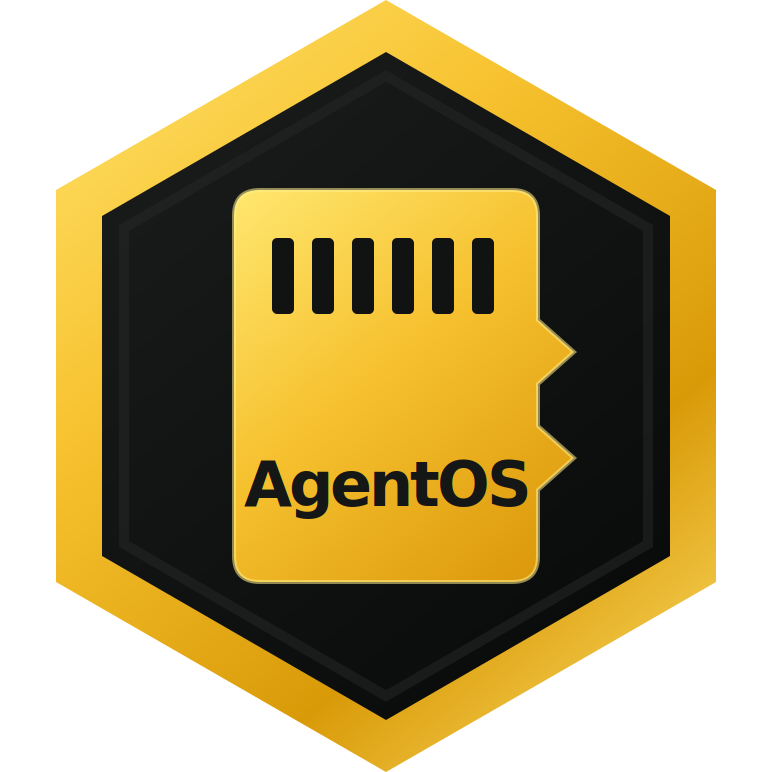
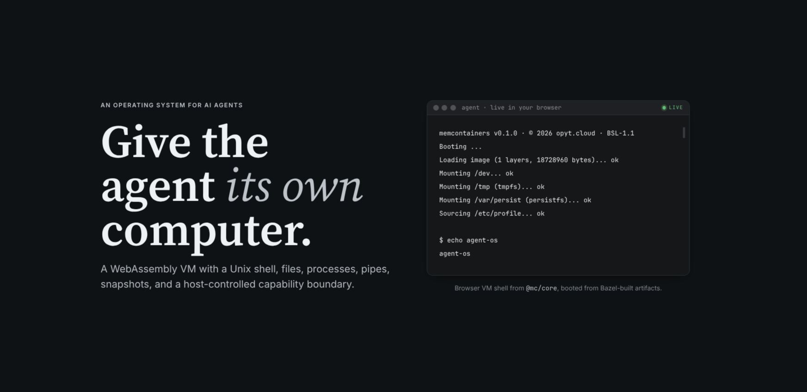

<div align="center">
  

  <h1>AgentOS</h1>

  <p><strong>A WebAssembly-native computer for AI agents.</strong></p>

  <p>
    <a href="https://deepwiki.com/NarendraPatwardhan/agent-os"></a>
    <a href="./LICENSE"></a>
    
    
    
<!-- BEGIN generated:image-size-badges -->
    <br>
    
    
    
    
    
<!-- END generated:image-size-badges -->
  </p>

  <p>
    <a href="#what-you-can-build">What You Can Build</a> -
    <a href="#client-api">Client API</a> -
    <a href="#calling-tools">Calling Tools</a> -
    <a href="#images">Images</a> -
    <a href="#reproducible-builds">Reproducible Builds</a> -
    <a href="#build-and-verification">Build and Verification</a>
  </p>

  <p>
    
  </p>
</div>

AgentOS gives AI agents a real computer: a contained Unix-like workspace with a
shell, files, network access, tools, data engines, document generation, and a
programmable scripting layer. It runs as WebAssembly, so the whole machine can be
paused, forked, replayed, moved, or restored as a value.

Use it when an agent needs to do actual work, not just call one API at a time.

- Connect an agent to your internal tools and SaaS APIs through one searchable
  tool catalog.
- Let the agent write programs that compose many tool calls in one turn.
- Mount data where the agent can inspect it with ordinary file commands.
- Run analysis in a warm SQLite service and generate PDFs with a warm Typst
  service.
- Build spreadsheet, document, and presentation workflows with the Luau Office
  batteries.
- Keep secrets, host objects, and raw infrastructure handles outside the
  sandbox.
- Snapshot a working agent, fork it into variants, and resume it with its warm
  state intact.

## What You Can Build

| Integration | What it enables |
|---|---|
| Host tools via `tool`, `kit` | Define any app or internal API as searchable in-VM tools with schemas. |
| HTTP/HTTPS and WebSocket egress | Fetch APIs and stream socket traffic through host-gated network access. |
| Credential registry | Inject bearer, header, or query credentials at the host boundary without putting secrets in guest memory. |
| `hostDir` mount | Mount a jailed local directory into the VM as ordinary files. |
| `s3` mount | Read and write S3 buckets through filesystem operations. |
| `vectorStore` mount | Expose retrieval and RAG as `cat /rag/search/<query>`. |
| Luau | Program multi-step tool workflows inside the VM. |
| SQLite / `atlas` | Run warm SQL data processing from the CLI or `require("sqlite")`. |
| Typst / `paper` | Generate warm PDF and document artifacts from the CLI or `require("typst")`. |
| Luau Office batteries | Work with XLSX, DOCX, PPTX, ZIP, OPC, XML, media, and chart helpers. |
| OPFS/IndexedDB persistence | Keep `/var/persist` durable in browser-backed runs. |
| Bun/browser JS host | Embed the same VM in local apps or browser experiences. |
| OpenAPI adapter | Compile REST APIs into tool catalog records. Presets include Stripe, GitHub REST, Vercel, Cloudflare, Neon, OpenAI, Sentry, Exa, Axiom, Asana, Twilio, DigitalOcean, Petstore, Val Town, Resend, and Spotify. |
| Microsoft Graph adapter | Microsoft 365 workflows across profile, mail, calendar, contacts, tasks, Planner, OneDrive, Excel, SharePoint, OneNote, Teams, meetings, users, groups, directory, identity, admin, security, Intune, education, search, and platform services. |
| Google Discovery adapter | Google workflows across Calendar, Gmail, Sheets, Drive, Docs, Slides, Forms, Tasks, People, Photos, Chat, Keep, YouTube, Search Console, Classroom, Admin, Apps Script, BigQuery, and Cloud Resource Manager. |
| GraphQL adapter | GitHub GraphQL, GitLab, Linear, Monday.com, and AniList workflows across repos, issues, merge requests, pipelines, users, projects, teams, cycles, boards, items, anime, and manga. |
| Remote MCP adapter | MCP workflows across DeepWiki, Context7, Browserbase, Firecrawl, Neon, Axiom, Stripe, Linear, Notion, Sentry, Cloudflare, and deterministic Emulate fixtures. |

## Why It Is Different

### The agent has a computer

Most tool platforms expose a bag of remote function calls. AgentOS gives the
agent an operating system. The agent can use a shell, write Luau, inspect files,
run pipelines, store intermediate artifacts, and call tools from code.

### Tools are discoverable at runtime

The `/svc/tools` broker owns a warm catalog. The `/tools` filesystem exposes the
same catalog as ordinary files. The Luau `tools` battery gives agents
`search`, `describe`, `call`, and dotted calls like
`tools.stripe.org.main.createCustomer(...)`.

This keeps prompts small while still giving the agent access to broad tool
surfaces.

### Heavy engines stay warm

SQLite, Typst, adapters, and the tool broker run as resident services inside the
VM. They pay their startup cost once, then serve CLI calls, Luau calls, and tool
calls through the same implementation.

### Snapshots preserve useful state

The VM's mutable state lives in WebAssembly linear memory: processes, services,
filesystem state, loaded modules, and warm handles. A snapshot captures the
computer, not just a log. Restoring it brings the agent back with its workspace
and warm services ready.

### Builds are reproducible and cached

Driving a VM is also a way to build one. `record` captures a live session, and
`llb` authors a build directly, as a content-addressed graph of filesystem steps.
Identical inputs reproduce the identical machine, and an unchanged step is a
cache hit — down to restoring an already-warm snapshot instead of rebooting. See
[Reproducible Builds](#reproducible-builds).

### The host stays in control

Secrets live in host-side credential registries. Host-backed mounts proxy bytes,
not handles. Network egress goes through the host. Tool calls can validate input
schemas before dispatch. The guest gets useful capabilities without receiving
the raw authority behind them.

## Client API

The SDK exposes one `Vm` surface:

```ts
import { mc, tool } from "@mc/core";
import { hostDir, s3, vectorStore } from "@mc/core/drivers";
import { z } from "zod";

const vm = await mc.create({
  runtime: "bun",
  image: "loom",
  net: true,
  deterministic: true,
  mounts: [
    { path: "/workspace", driver: hostDir({ root: "./workspace" }) },
    { path: "/assets", driver: s3({ bucket: "acme-assets", readOnly: true }) },
    { path: "/rag", driver: vectorStore({ embed, search }) },
  ],
  tools: [
    tool({
      name: "customer lookup",
      description: "Find a customer by account id.",
      input: z.object({ accountId: z.string() }),
      run: async ({ accountId }) => crm.lookup(accountId),
    }),
  ],
});

await vm.fs.write("/tmp/task.txt", "Find unpaid invoices and draft a report.");

const result = await vm.luau(`
local tools = require("tools")
local customer = tools.host.org.main.customer.lookup({ accountId = "acme" })
print(customer.ok and "ready" or customer.err.message)
`);

const snapshot = await vm.snapshot();
const fork = await vm.fork();
```

Core operations:

| Surface | What it enables |
|---|---|
| `vm.exec(cmd)` | Run shell commands and pipelines inside the VM. |
| `vm.luau(src)` | Run multi-step agent programs without model round-trips. |
| `vm.fs` | Read, write, list, stat, remove, and symlink VM files. |
| `vm.tool(...)` | Register host-resident tools into the live in-VM catalog. |
| `vm.mount(...)` | Expose host-backed storage or retrieval systems as files. |
| `vm.snapshot()` / `vm.fork()` | Capture, restore, and branch an agent workspace. |
| `vm.commit().asLayer()` | Turn VM changes into a reusable image layer. |
| `vm.shell()` | Attach an interactive shell or Luau REPL. |
| `vm.cron(...)` | Schedule recurring actions against a live VM. |

## Images

Choose the image that matches the job:

| Image | Includes | Best for |
|---|---|---|
| `minimal` | Shell, core builtins, package daemon, tools broker | Small custom harnesses |
| `posix` | `minimal` plus the full coreutils command set | File and text automation |
| `loom` | `posix` plus Luau and `luau-analyze` | Programmable agents |
| `atlas` | `loom` plus warm SQLite and `require("sqlite")` | Data workflows |
| `paper` | `loom` plus warm Typst and `require("typst")` | PDF and document workflows |

## Reproducible Builds

Driving a VM and *building* one are the same act. Every `vm.fs.write` and
`vm.exec` is a build step — capture the steps and you get a content-addressed,
incrementally-cached build that reproduces the exact same machine. Two surfaces
expose this, and both run on every runtime: bun, browser, and remote.

### `record` — capture a session as a build

`mc.record` returns a VM that runs live *and* records its mutating steps as a
build graph. Nothing new to learn: drive the VM as usual, then take the result.

```ts
import { mc, llb } from "@mc/core";

const rec = await mc.record({ image: "loom" });
await rec.vm.exec("setup.sh");
await rec.vm.fs.write("/etc/agent/policy.json", policy);

const warm = await llb.commit(rec.build()).asSnapshot();
// Re-running an unchanged session is a cache hit — restore the warm VM instantly.
```

### `llb` — the build grammar

`llb` is a small, composable grammar: a content-addressed DAG of filesystem ops.
Each verb returns an opaque handle and runs nothing until you `commit`. The verbs
map 1:1 onto VM primitives, so there is no Dockerfile to learn.

```ts
import { llb } from "@mc/core";

const base = llb.exec(llb.source("posix"), "install deps", { tier: "isolated" });

// One VM timeline is linear; a graph can branch, share, and merge.
const image = llb.image([base, llb.write(base, "/etc/flavor", "acme")]);

const layer = await llb.commit(image).asLayer();     // portable .tar layer
const manifest = await llb.commit(image).asImage();  // bootable image
const snap = await llb.commit(image).asSnapshot();   // whole warm VM
```

| Selector | Result |
|---|---|
| `.asLayer()` | The portable `.tar` layer the node produced. |
| `.asImage()` | The full image manifest — layer stack plus runtime contract. |
| `.asSnapshot()` | The whole-VM warm memory image, ready for `mc.restore`. |

Why it pays off:

- **Sound caching.** A node's identity is a Merkle digest of its op, inputs, and
  args. Edit one step and only its downstream sub-graph re-runs; everything
  upstream is a cache hit. Deterministic runs and the `isolated` tier make that
  cache provably correct — a guarantee a Dockerfile can't make.
- **Warm-snapshot reuse.** A cache hit on `.asSnapshot()` restores an
  already-warm VM — services up, modules loaded, deps installed — instead of
  cold-booting. This is the fast path for agent cold-start.
- **Provenance.** The graph digest *is* the image's identity: the same inputs
  produce the same machine, on any runtime.

## Integration Model

AgentOS supports integrations in four complementary ways:

1. Host tools: define a typed tool in application code and expose it through
   `/svc/tools`.
2. API adapters: compile OpenAPI, Microsoft Graph, or Google Discovery sources
   into ordinary tool catalog records.
3. Host-backed mounts: expose local directories, S3 buckets, vector retrieval,
   or a custom driver as a filesystem tree.
4. In-VM engines: use Luau, SQLite, Typst, shell tools, and Office batteries to
   transform data and generate artifacts.

These paths compose. An agent can call Google Sheets, write rows into SQLite,
join them with files mounted from S3, generate a PDF in Typst, and return the
artifact from one program.

## Calling Tools

Tools are how an agent reaches the outside world — GitHub, Google, Microsoft, a
custom API, or your own host functions. The model is a clean split: the
**embedder** declares connections (specs, credentials, egress policy) when it
creates the VM; the **agent inside the VM** only ever sees tool *addresses* and
JSON arguments. The credential is spliced in host-side at egress and never enters
the guest.

Every tool has an address `‹integration›.‹owner›.‹connection›.‹tool›` — e.g.
`github.org.main.issues-create`. The `‹owner›.‹connection›` (default `org.main`)
names the connection the host resolves to a credential and an origin allowlist.

**From the shell** — the `tools` applet, backed by `/svc/tools`:

```sh
tools list                                   # every available address
tools search "issue" --limit 5               # ranked discovery
tools describe github.org.main.issues-create # input/output JSON schema
tools call github.org.main.issues-create '{"path":{"owner":"me","repo":"r"},"body":{"title":"hi"}}'
github issues-create '{ ... }'               # /bin alias (argv[0] dispatch)
```

Every call returns `{"ok":true,"data":…}` or
`{"ok":false,"err":{"code":…,"message":…}}`. Large or binary results land as a
file under `/tmp/tools/results` (or `--output /path`). `call` requires the
caller's `CAP_NET`; discovery does not. A read-only mirror lives at
`/tools/‹integration›/‹owner›/‹connection›/‹tool›`.

**From Luau** — `require("tools")`:

```lua
local tools = require("tools")
local rec = tools.describe("github.org.main.issues-create")
local res = tools.call("github.org.main.issues-create", { path = {...}, body = {...} })
print(res.ok, res.data)
-- or the dotted proxy: tools.github.org.main["issues-create"]({ ... })
```

**Your own functions are tools too.** A `tool()` / `kit()` defined in the SDK is
a first-class catalog entry (address `host.org.main.‹name›` by default); the
agent calls it exactly like an API tool — `tools call host.org.main.greet '"world"'`
— and your host function answers.

**Adding an integration** is the embedder's `mc.create`. For a curated
integration, name the capability and hand over a key:

```js
const vm = await mc.use("github.issues", process.env.GITHUB_TOKEN, { kernel, image });
```

For any other API, supply the spec — `openapi`, `microsoft-graph`,
`google-discovery`, `graphql`, or `mcp-remote` — as a URL, bytes, or path, plus
the credential and the origins the credential may reach:

```js
await mc.create({
  kernel, image, net: true, permissions: { network: "allow" },
  connections: [{
    ref: "acme.org.main",
    auth: { kind: "bearer", token: process.env.ACME_TOKEN },
    origins: ["https://api.acme.com"],
    spec: { format: "openapi", url: "https://api.acme.com/openapi.json" },
  }],
});
```

The host compiles the spec into catalog records — a `graphql` / `mcp-remote`
endpoint is *discovered live* instead — and the new `acme.org.main.*` tools
appear to the agent immediately. The connection's `origins` confine the
credential to the hosts it may reach; an attempt to egress anywhere else fails
closed.

## Build and Verification

The project is built as a Bazel graph. Generated contracts, kernel artifacts,
guest programs, images, SDK packages, and end-to-end tests all declare their
inputs, so tests run against the artifacts produced by the current source tree.

Useful commands:

```sh
bazel test //memcontainers/tests/e2e:core
bazel test //memcontainers/tests/e2e:extended
bazel test //memcontainers/sdk-js/core:vm_test
bazel test //...
```

The design contract for contributors is [SYSTEMS.md](./SYSTEMS.md).
