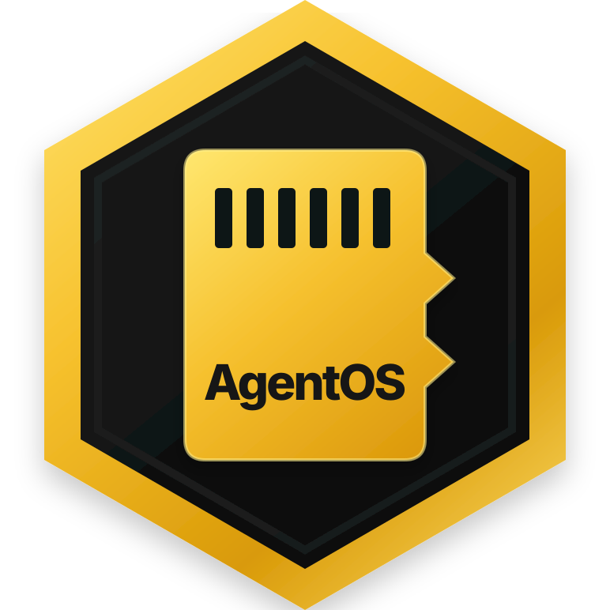
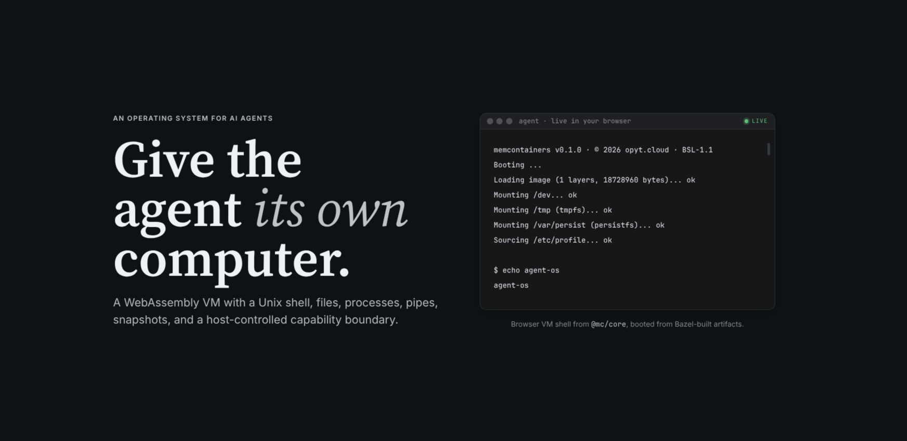

<div align="center">
  

  <h1>AgentOS</h1>

  <p><strong>Give the agent its own computer.</strong></p>

  <p>
    A WebAssembly VM with a Unix shell, files, processes, pipes, resident services,
    snapshots, and a host-controlled capability boundary.
  </p>

  <p>
    <a href="https://agentos.opyt.cloud"></a>
    <a href="https://deepwiki.com/NarendraPatwardhan/agent-os"></a>
    <a href="./LICENSE"></a>
    
    
<!-- BEGIN generated:image-size-badges -->
    <br>
    
    
    
    
    
<!-- END generated:image-size-badges -->
  </p>

  <p>
    <a href="#what-you-can-build">What You Can Build</a> ·
    <a href="#why-agentos">Why AgentOS</a> ·
    <a href="#quickstart">Quickstart</a> ·
    <a href="https://agentos.opyt.cloud/#examples">Examples</a> ·
    <a href="./docs/index.md">API Reference</a> ·
    <a href="#performance">Performance</a>
  </p>

  <p>
    
  </p>
</div>

AgentOS gives an agent a real, contained computer instead of a bag of disconnected function calls.
The guest can inspect files, compose shell pipelines, write programs, call tools, query data, and
produce artifacts without receiving ambient authority over the host.

The complete machine runs as WebAssembly. Its filesystem, processes, loaded programs, and warm
services can be captured, moved, restored, or forked as a value. The same JavaScript `Vm` API runs in
Node.js, Bun, the browser, and against a remote AgentOS host.

## What You Can Build

| Product                         | What AgentOS provides                                                                                                  |
| ------------------------------- | ---------------------------------------------------------------------------------------------------------------------- |
| Coding agents                   | An isolated repo workspace, POSIX tools, Luau automation, static analysis, and structural Lua/Luau parsing and edits.  |
| Tool-using agents               | Searchable, schema-bearing host tools that can be discovered and composed from the shell or Luau.                      |
| SaaS automation                 | OpenAPI, GraphQL, Microsoft Graph, Google Discovery, and remote MCP connections with host-held credentials.            |
| Data and retrieval agents       | A warm SQLite service, S3-backed files, vector-search mounts, and ordinary shell data pipelines.                       |
| Document workflows              | XLSX, DOCX, PPTX, ZIP, OPC, XML, media, chart, and warm Typst/PDF tooling.                                             |
| Browser sandboxes               | The full VM in a page, durable OPFS-backed state, terminals, editors, and no server required for execution.            |
| Stateful agent branches         | Whole-machine snapshots and independent forks that preserve files, processes, and warm services.                       |
| Reproducible agent environments | Content-addressed images and LLB build graphs that cache work down to a ready-to-resume warm snapshot.                 |
| Secure internal automation      | Jailed host-directory mounts, origin-scoped network access, approval hooks, and secrets that never enter guest memory. |
| Local and remote products       | One VM surface across in-process Node.js/Bun, browser, and served remote runtimes.                                     |

These capabilities compose. An agent can discover an API, read source data through a mount, join it in
SQLite, edit code structurally, generate a PDF, and snapshot the completed workspace from one program.

## Why AgentOS

### The agent gets a computer

Most agent runtimes expose one remote call at a time. AgentOS gives the model a shell, filesystem,
processes, pipes, scripting, services, and persistent intermediate state. The agent can turn a plan
into a program and do several steps without another model round-trip.

### The host keeps the authority

Credentials, network policy, mounts, and tool implementations stay outside the guest. The VM sees
capability addresses and bytes—not bearer tokens, cloud clients, file descriptors, or raw host
objects. Applications decide what the machine may reach and can require approval at the boundary.

### Useful services stay warm

The tools broker, SQLite, Typst, and other resident services start once and then serve shell commands,
Luau programs, and host calls through the same implementation. A snapshot preserves that initialized
state instead of reducing a workspace to a transcript and a directory archive.

### State is a portable value

Capture the entire running machine, restore it elsewhere, or fork it into independent branches. Full
snapshots are self-contained; incremental snapshots carry only memory pages changed from a known full
baseline. Images, layers, snapshots, and build definitions are content-addressed values.

### One API runs everywhere

The VM does not change shape when its host changes:

| Runtime   | Where the kernel runs              | Good for                                                                 |
| --------- | ---------------------------------- | ------------------------------------------------------------------------ |
| `local`   | The current Node.js or Bun process | Applications, agents, CLIs, and local development                        |
| `browser` | The current browser page           | Interactive products, sandboxes, demos, and private local work           |
| `remote`  | An AgentOS server                  | Durable services, shared infrastructure, and server-controlled execution |

## Quickstart

Install the runtime, kernel, catalog compiler, git engine, and an image from the AgentOS site:

```sh
curl -fsSL https://agentos.opyt.cloud/install.sh | bash
```

The interactive installer offers two modes:

- `agentic` installs the programmable `loom` image and an AgentOS skill for coding agents.
- `embedded` installs application runtime artifacts and defaults to the smaller `posix` image.

For a non-interactive application install:

```sh
curl -fsSL https://agentos.opyt.cloud/install.sh \
  | AGENTOS_MODE=embedded AGENTOS_IMAGE=loom AGENTOS_DIR=./agent-os bash
```

Point the shell at the install (paths, artifact cache, defaults):

```sh
source ./agent-os/env.sh
```

Create `example.mjs` beside the installed `agent-os/` directory. After `env.sh`, create options can omit
kernel and image bytes — the host resolves them from the install dir and cache:

```js
import { mc } from "./agent-os/mc-core.mjs";

const vm = await mc.create({
  // kernel / image / catalogCompiler resolve via AGENTOS_DIR (from env.sh)
  // optional: git: true,
  deterministic: true,
});

try {
  await vm.fs.write("/workspace/input.txt", "paid\nfailed\npaid\n");
  const result = await vm.exec("sort /workspace/input.txt | uniq -c | sort -rn");
  if (result.exitCode !== 0) throw new Error(result.stderr);
  process.stdout.write(result.stdout);

  // Exact argv, with no shell parsing or quoting.
  const exact = await vm.run("printf", ["<%s>\\n", "two words"]);
  if (exact.exitCode !== 0) throw new Error(exact.stderr);

  const branch = await vm.fork();
  try {
    await branch.fs.write("/workspace/next-step.txt", "continue independently\n");
  } finally {
    await branch.close();
  }
} finally {
  await vm.close();
}
```

Run it with either local host (same shell where you sourced `env.sh`, or export those variables in
your process manager):

```sh
node example.mjs
# or
bun example.mjs
```

You can still pass `kernel` / `image` / `catalogCompiler` as `Uint8Array` when you load artifacts
yourself (browser, custom layout). Use `vm.exec()` for shell syntax and `vm.run()` for an executable
plus literal arguments. An exit code describes the guest process; `vm.close()` releases the host-side
VM and its registered capabilities.

## Capabilities Without Ambient Authority

AgentOS starts without secrets, host directories, application callbacks, or unrestricted network
access. The embedding application adds only what a workload needs:

- **Tools** expose application functions as discoverable, schema-bearing calls.
- **Connections** turn OpenAPI, GraphQL, Microsoft Graph, Google Discovery, and MCP services into the
  same tool catalog while keeping credentials at the host boundary.
- **Mounts** expose a jailed host directory, S3 prefix, vector index, or custom data source as ordinary
  guest files.
- **Permissions** gate guest egress by origin, operation, and application approval policy.

Inside the VM, the agent uses one consistent interface:

```sh
tools search customer
tools describe host.org.main.customer.lookup
tools call host.org.main.customer.lookup '{"accountId":"acme"}'
```

The same catalog is available to Luau, so an agent can write and run a multi-step workflow rather than
spending one model turn per tool call.

## Images

Choose the smallest environment that contains the workload:

| Image     | Includes                                                                         | Best for                                        |
| --------- | -------------------------------------------------------------------------------- | ----------------------------------------------- |
| `minimal` | Shell, boot services, minimal core commands, tools broker                        | Small custom harnesses                          |
| `posix`   | `minimal` plus the full coreutils command set                                    | File and text automation                        |
| `loom`    | `posix` plus Luau, static analysis, Office batteries, and owned Lua/Luau parsers | Programmable agents and structural code editing |
| `atlas`   | `loom` plus the warm SQLite service                                              | Data and retrieval workflows                    |
| `paper`   | `loom` plus the warm Typst service and fonts                                     | PDF and document generation                     |

Images are layered and capability-stamped. Switching images changes guest userland without changing
the JavaScript API.

## State, Forks, and Reproducible Builds

`vm.snapshot()` captures the running computer. `vm.fork()` creates an independent branch with the
same machine state and current host attachments. `vm.commit().asLayer()` exports filesystem changes as
a reusable content-addressed layer.

AgentOS can also record live VM mutations as an LLB definition or construct a build graph directly.
Identical inputs reproduce the same machine, unchanged nodes remain cache hits, and a cached result
can be a warm snapshot rather than a cold filesystem image.

```js
const snapshot = await vm.snapshot();
const branch = await vm.fork();
const layer = await vm.commit().asLayer();
```

## Performance

Standard-profile p50s on the intersection of the browser and server (BEAM NIF) lanes.
Boot and command costs are wall-clock milliseconds. Full snapshot and restore are
**ms per MB** of MCSN payload so hosts with different resident memory stay comparable.

| Metric | Unit | Browser | Server | Why |
| ------ | ---- | ------- | ------ | --- |
| cold_start.shell (posix) | ms | 17 | **5.9** | Time to a usable shell after create — first agent turn and interactive “is it up?” feel. |
| exec.shell_builtin.steady | ms | 18 | **4.6** | Cost of ordinary shell work (`cd` and other special builtins) once the machine is warm. |
| exec.direct_minimal.steady | ms | 15 | **1.8** | Structured minimal exec without a nested shell — lower bound for host-driven commands. |
| exec.direct_external.steady | ms | 15 | **1.9** | Structured launch of an external guest program — typical “run this tool” path agents use. |
| exec.pipeline.three_stage | ms | 32 | **19** | Multi-process pipes; real agent workflows chain filters, not single commands. |
| snapshot.full.latency | ms/MB | **5.1** | 6.0 | How expensive a complete checkpoint is per MB of machine state (branch / handoff / save). |
| snapshot.restore_full | ms/MB | **5.5** | 7.3 | How fast you can rehydrate a full snapshot per MB (resume, move, or spin a branch). |
| resident.sqlite.first (atlas) | ms | **189** | 261 | First hit against a warm SQLite service after boot — cold data-path for retrieval agents. |
| resident.sqlite.warm (atlas) | ms | 84 | **42** | Repeat SQLite work once the resident service is hot — steady query / tool loop cost. |

## Explore AgentOS

| Resource                                                     | Use it for                                                              |
| ------------------------------------------------------------ | ----------------------------------------------------------------------- |
| [AgentOS by Example](https://agentos.opyt.cloud/#examples)   | Live, editable demonstrations running in the browser VM                 |
| [JavaScript API reference](./docs/index.md)                  | Public methods, options, runtime behavior, browser elements, and errors |
| [DeepWiki](https://deepwiki.com/NarendraPatwardhan/agent-os) | Architecture, implementation details, and contributor documentation     |
| [SYSTEMS.md](./SYSTEMS.md)                                   | The source-of-truth system invariants and design contract               |
